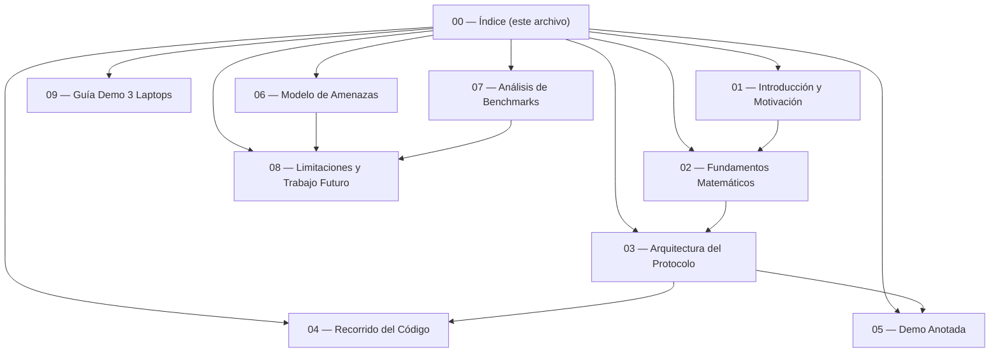

# Documentación Exhaustiva — Protocolo Híbrido Post-Cuántico de Autenticación de Firmware IoT

## Visión General del Proyecto

Este proyecto implementa un **esquema de autenticación híbrida de doble firma** para firmware de dispositivos IoT, combinando criptografía clásica (Ed25519) y post-cuántica (ML-DSA-65) bajo un modelo de verificación **AND**: ambas firmas deben ser válidas simultáneamente para que el firmware sea aceptado. Adicionalmente, el protocolo incorpora cifrado híbrido (X25519 + ML-KEM-768) para confidencialidad en tránsito.

---

## Mapa de Documentación



---

## Índice de Documentos

| # | Documento | Descripción |
|---|---|---|
| 01 | [Introducción y Motivación](01_introduccion.md) | El problema de la transición cuántica, el modelo Harvest Now Decrypt Later, por qué firmware IoT es el caso de uso ideal, y la tesis central del proyecto. |
| 02 | [Fundamentos Matemáticos](02_fundamentos_matematicos.md) | Matemáticas formales de cada primitivo criptográfico: Ed25519, ML-DSA-65, SHA3-256, X25519, ML-KEM-768, HKDF y los cifrados AEAD. |
| 03 | [Arquitectura del Protocolo](03_arquitectura_protocolo.md) | Pipeline Sign-then-Encrypt completo, diagramas de flujo, estructuras de datos, modelo AND de verificación, y selección adaptativa de cifrado. |
| 04 | [Recorrido del Código](04_recorrido_codigo.md) | Explicación módulo por módulo de `protocol.py`, `benchmark.py`, `demo.py` y `network_validation.py`, con referencias a funciones y líneas. |
| 05 | [Demo Anotada](05_demo_anotada.md) | Recorrido paso a paso de un ciclo completo del protocolo, explicando qué sucede con los bytes en cada etapa, incluyendo intercepción MITM y caso de fallo. |
| 09 | [Guía demo 3 laptops](09_guia_demo_tres_laptops.md) | Instalación, claves compartidas, IPs, firewall, orden de arranque y solución de problemas para la demo en aula con `demo_nodes/`. |
| 06 | [Modelo de Amenazas](06_modelo_amenazas.md) | Escenarios de ataque (clásico, cuántico, combinado, implementación), garantías de seguridad, robustez transicional y propiedades del canal. |
| 07 | [Análisis de Benchmarks](07_analisis_benchmarks.md) | Resultados experimentales reales: tiempos por fase, overhead criptográfico, throughput, comparación de esquemas e interpretación. |
| 08 | [Limitaciones y Trabajo Futuro](08_limitaciones_trabajo_futuro.md) | Alcance explícito del proyecto, limitaciones reconocidas, y direcciones de investigación futura. |

---

## Estructura del Proyecto

```
implementation/
├── AGENTS.md                          # Reglas del agente de desarrollo
├── requirements.txt                   # Dependencias Python
├── docs/
│   ├── 00_indice.md                   # ← Este archivo
│   ├── 01_introduccion.md
│   ├── 02_fundamentos_matematicos.md
│   ├── 03_arquitectura_protocolo.md
│   ├── 04_recorrido_codigo.md
│   ├── 05_demo_anotada.md
│   ├── 09_guia_demo_tres_laptops.md
│   ├── 06_modelo_amenazas.md
│   ├── 07_analisis_benchmarks.md
│   ├── 08_limitaciones_trabajo_futuro.md
│   ├── brief.md
│   ├── Project_briefing_team.md
│   └── ...
└── dual_sig_research/
    ├── protocol.py                    # Núcleo criptográfico
    ├── benchmark.py                   # Suite de benchmarking
    ├── demo.py                        # Demo interactiva
    ├── network_validation.py          # Validación TCP/red
    ├── demo_nodes/                    # Scripts por rol (demo 3 laptops)
    ├── firmware_samples/              # Blobs binarios de prueba
    └── results/                       # CSVs, JSONs y figuras
```

---

## Primitivos Criptográficos Utilizados

| Capa | Clásico | Post-Cuántico | Función |
|---|---|---|---|
| **Firma digital** | Ed25519 (RFC 8032) | ML-DSA-65 (FIPS 204) | Autenticación de firmware (modelo AND) |
| **Intercambio de clave** | X25519 (RFC 7748) | ML-KEM-768 (FIPS 203) | Encapsulación de clave simétrica |
| **Hash** | — | SHA3-256 (FIPS 202) | Integridad del firmware |
| **Derivación de clave** | — | HKDF-SHA3-256 | Combinación de shared secrets |
| **Cifrado simétrico** | AES-256-GCM | ChaCha20-Poly1305 | Confidencialidad en tránsito (adaptativo) |

---

## Convención de Lectura

Se recomienda leer los documentos en orden numérico. Los documentos 01-03 proporcionan el marco teórico, 04-05 explican la implementación concreta, y 06-08 analizan resultados y limitaciones.

Para la terminología criptográfica y las fórmulas matemáticas, consultar primero el documento [02 — Fundamentos Matemáticos](02_fundamentos_matematicos.md).
