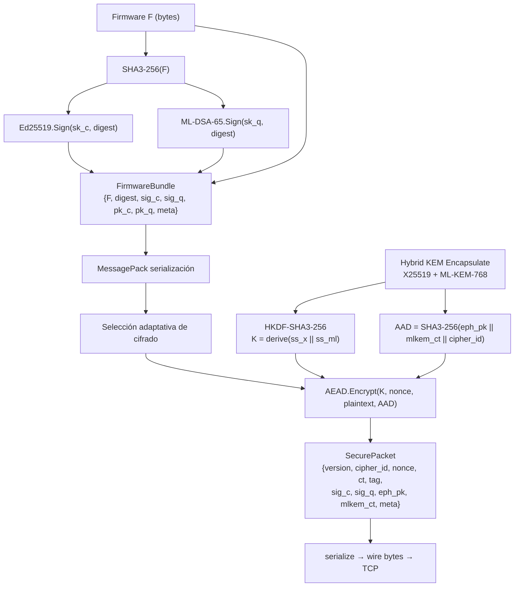
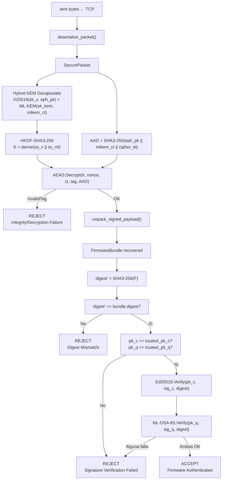
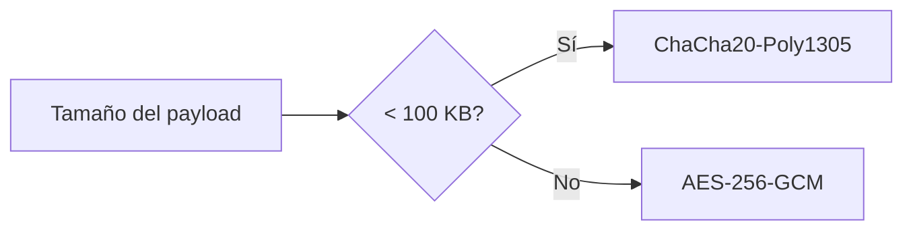
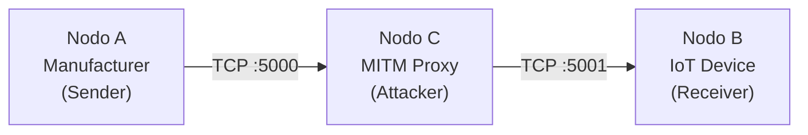

# 03 — Arquitectura del Protocolo

[← Fundamentos Matemáticos](02_fundamentos_matematicos.md) | [Índice](00_indice.md) | [Siguiente: Recorrido del Código →](04_recorrido_codigo.md)

---

## 1. Visión General: Sign-then-Encrypt (StE)

El protocolo sigue una arquitectura **Sign-then-Encrypt**: primero se autentica el firmware con firma dual, luego se cifra el bundle firmado completo para transmisión segura. Este orden es deliberado:

- **Sign-then-Encrypt** garantiza que las firmas están protegidas por el cifrado durante el tránsito, impidiendo que un observador pasivo correlacione firmas con identidades.
- El receptor primero descifra y luego verifica — si el descifrado falla (tag AEAD inválido), se rechaza inmediatamente sin intentar verificar firmas sobre datos corrompidos.

---

## 2. Pipeline del Emisor (Manufacturer)



### Pasos detallados:

1. **Hash**: se calcula $\text{digest} = \text{SHA3-256}(F)$ — un resumen de 32 bytes del firmware completo.
2. **Firma clásica**: $\text{sig}\_\text{c} = \text{Ed25519.Sign}(sk_c, \text{digest})$ — 64 bytes.
3. **Firma post-cuántica**: $\text{sig}\_\text{q} = \text{ML-DSA-65.Sign}(sk_q, \text{digest})$ — 3,309 bytes. Ambas firmas se calculan sobre el **mismo digest**, manteniendo los esquemas completamente independientes.
4. **Empaquetado**: el `FirmwareBundle` (firmware + digest + ambas firmas + claves públicas + metadata) se serializa con MessagePack.
5. **Selección de cifrado**: según el tamaño del payload serializado, se elige ChaCha20-Poly1305 (< 100 KB) o AES-256-GCM (≥ 100 KB).
6. **KEM híbrido**: se genera un par efímero X25519, se realiza ECDH con la clave pública del receptor, y paralelamente se encapsula con ML-KEM-768 contra la clave KEM pública del receptor. Se obtienen dos shared secrets.
7. **Derivación**: $K = \text{HKDF-SHA3-256}(ss_{x25519} \| ss_{mlkem}, \text{info}=\texttt{"hybrid-firmware-kem-v1"})$ — clave simétrica de 256 bits.
8. **AAD**: $\text{AAD} = \text{SHA3-256}(\text{eph\_pk} \| \text{mlkem\_ct} \| \text{cipher\_id})$ — vincula los parámetros KEM al contexto AEAD, previniendo ataques de sustitución.
9. **Cifrado**: AEAD produce nonce (12 bytes aleatorios), ciphertext y tag de autenticación (16 bytes).
10. **Paquete**: se construye el `SecurePacket` con todos los campos y se serializa con MessagePack para transmisión TCP.

---

## 3. Pipeline del Receptor (IoT Device)



### Lógica de verificación AND

El punto crítico del receptor es la verificación dual. La función `verify()` implementa una **conjunción estricta**:

```
ACCEPT = digest_match AND pk_c_trusted AND pk_q_trusted AND Ed25519_OK AND ML_DSA_OK
```

Si **cualquiera** de estas condiciones falla, el firmware se rechaza. No hay modo de "pasar" con solo una firma válida. Cada fallo genera un log de alerta (`[ALERT]`) con la causa específica.

---

## 4. Estructuras de Datos

### 4.1 KeyMaterial

Contiene todo el material criptográfico de un participante (manufacturer o device):

| Campo | Tipo | Tamaño | Descripción |
|---|---|---|---|
| `pk_c` | `bytes` | 32 B | Clave pública Ed25519 |
| `sk_c` | `Ed25519PrivateKey` | 32 B | Clave privada Ed25519 |
| `pk_q` | `bytes` | 1,952 B | Clave pública ML-DSA-65 |
| `sk_q` | `bytes` | 4,032 B | Clave privada ML-DSA-65 |
| `pk_x` | `bytes` | 32 B | Clave pública X25519 |
| `sk_x` | `X25519PrivateKey` | 32 B | Clave privada X25519 |
| `pk_kem` | `bytes` | 1,184 B | Clave pública ML-KEM-768 |
| `sk_kem` | `bytes` | 2,400 B | Clave privada ML-KEM-768 |

**Total clave pública**: 32 + 1,952 + 32 + 1,184 = **3,200 bytes**.
**Total clave privada**: 32 + 4,032 + 32 + 2,400 = **6,496 bytes**.

### 4.2 FirmwareBundle

El bundle firmado (en claro, antes de cifrar):

| Campo | Tipo | Tamaño (1KB firmware) | Descripción |
|---|---|---|---|
| `firmware` | `bytes` | 1,024 B | Contenido binario del firmware |
| `digest` | `bytes` | 32 B | SHA3-256(firmware) |
| `sig_c` | `bytes` | 64 B | Firma Ed25519 |
| `sig_q` | `bytes` | 3,309 B | Firma ML-DSA-65 |
| `pk_c` | `bytes` | 32 B | Clave pública Ed25519 del firmante |
| `pk_q` | `bytes` | 1,952 B | Clave pública ML-DSA-65 del firmante |
| `metadata` | `dict` | variable | Algoritmos usados, etc. |

**Total estimado** (serializado con MessagePack): ~6,500 bytes para 1 KB de firmware.

### 4.3 SecurePacket

El paquete cifrado listo para transmisión:

| Campo | Tipo | Descripción |
|---|---|---|
| `protocol_version` | `int` | Versión del protocolo (actualmente 1) |
| `cipher_identifier` | `str` | `"chacha20-poly1305"` o `"aes-256-gcm"` |
| `nonce` | `bytes` (12 B) | Nonce único por paquete |
| `ciphertext` | `bytes` | Payload cifrado (sin tag) |
| `auth_tag` | `bytes` (16 B) | Tag de autenticación AEAD |
| `ed25519_signature` | `bytes` (64 B) | Firma clásica (también dentro del ciphertext) |
| `mldsa_signature` | `bytes` (3,309 B) | Firma PQ (también dentro del ciphertext) |
| `x25519_public_key` | `bytes` (32 B) | Clave efímera X25519 del emisor |
| `mlkem_ciphertext` | `bytes` (1,088 B) | Ciphertext ML-KEM-768 |
| `metadata` | `dict` | Tamaños, umbral de cifrado, etc. |

**Nota**: las firmas aparecen tanto dentro del ciphertext (como parte del FirmwareBundle cifrado) como en campos exteriores del SecurePacket. Esto es por diseño: permite al receptor inspeccionar los campos KEM y las firmas sin descifrar, aunque la verificación real se hace sobre el bundle descifrado.

---

## 5. Selección Adaptativa de Cifrado



**Razonamiento**:

| Criterio | ChaCha20-Poly1305 | AES-256-GCM |
|---|---|---|
| Sin aceleración hardware | Más rápido (ARX puro) | Más lento (tabla S-box) |
| Con AES-NI | Comparable | Significativamente más rápido |
| Overhead de inicialización | Bajo | Mayor (GCM setup) |
| Payloads pequeños (< 100 KB) | **Preferido** | Overhead proporcionalmente alto |
| Payloads grandes (≥ 100 KB) | Aceptable | **Preferido** (AES-NI domina) |

El umbral de 100 KB es una constante configurable (`DEFAULT_CIPHER_THRESHOLD`) que se puede ajustar según el hardware destino.

---

## 6. Serialización con MessagePack

El protocolo usa **MessagePack** (no JSON, no Protocol Buffers) para serialización por varias razones:

| Propiedad | MessagePack | JSON | Protobuf |
|---|---|---|---|
| Formato | Binario | Texto | Binario |
| Soporte de `bytes` nativo | **Sí** | No (requiere base64) | Sí |
| Sin esquema requerido | Sí | Sí | **No** (necesita .proto) |
| Overhead | Mínimo | Alto (~2x) | Mínimo |
| Simplicidad | Alta | Alta | Baja |

MessagePack es ideal para este caso: datos binarios pesados (firmas, ciphertexts) que necesitan serialización eficiente sin overhead de codificación.

---

## 7. Additional Authenticated Data (AAD)

El AAD es un componente crítico de seguridad del cifrado AEAD. No se cifra, pero sí se autentica — cualquier modificación del AAD invalida el tag:

$$\text{AAD} = \text{SHA3-256}(\text{eph}\_\text{pk}_{x25519} \| \text{mlkem}\_\text{ct} \| \text{cipher}\_\text{id}.\text{encode}(\texttt{"ascii"}))$$

Esto vincula:
- La **clave efímera X25519** del emisor.
- El **ciphertext ML-KEM** (que encapsula parte del shared secret).
- El **identificador del cifrado** seleccionado.

Un atacante que modifique el ciphertext KEM (intentando una downgrade attack o sustitución) invalidará el AAD y, por ende, el tag AEAD — el receptor rechazará el paquete.

---

## 8. Protocolo de Red

### 8.1 Formato de Trama TCP

Cada paquete se transmite con un encabezado de longitud de 4 bytes (big-endian unsigned int):

```
[4 bytes: longitud N][N bytes: payload MessagePack]
```

La función `send_framed()` envía `struct.pack("!I", len(payload)) + payload`, y `recv_framed()` primero lee los 4 bytes del encabezado, luego lee exactamente `N` bytes del payload.

### 8.2 Topología de Red



En el escenario local, el MITM proxy escucha en el puerto 5000 (donde conecta el sender) y reenvía al puerto 5001 (donde escucha el receiver). El proxy puede:

- **Observar** pero no descifrar (escenario pasivo).
- **Modificar** un bit del ciphertext o del KEM ciphertext (escenario activo) — provocando un rechazo en el receptor.

---

[← Fundamentos Matemáticos](02_fundamentos_matematicos.md) | [Índice](00_indice.md) | [Siguiente: Recorrido del Código →](04_recorrido_codigo.md)
