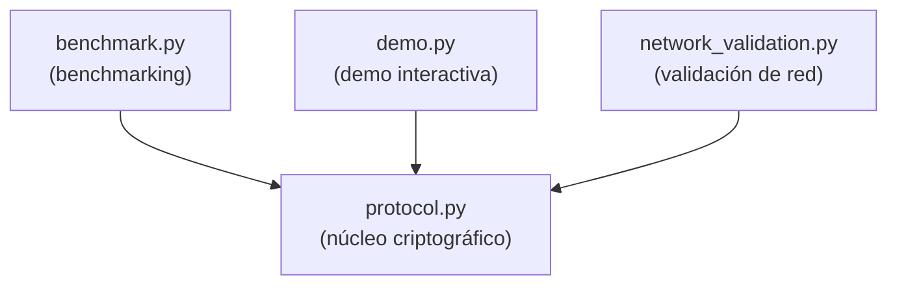

# 04 — Recorrido del Código

[← Arquitectura del Protocolo](03_arquitectura_protocolo.md) | [Índice](00_indice.md) | [Siguiente: Demo Anotada →](05_demo_anotada.md)

---

Este documento explica cada módulo Python del proyecto, describiendo la responsabilidad de cada función, cómo se conectan entre sí, y las decisiones de diseño relevantes.

---

## 1. `protocol.py` — Núcleo Criptográfico (673 líneas)

Este es el módulo central. Contiene todas las operaciones criptográficas y define las estructuras de datos del protocolo. No tiene dependencias internas — todos los demás módulos importan de él.

### 1.1 Constantes y Tipos (líneas 32-84)

```python
PROTOCOL_VERSION: Final[int] = 1
ML_DSA_ALG: Final[str] = "ML-DSA-65"
ML_KEM_ALG: Final[str] = "ML-KEM-768"
DIGEST_SIZE: Final[int] = 32
NONCE_SIZE: Final[int] = 12
SYMMETRIC_KEY_SIZE: Final[int] = 32
DEFAULT_CIPHER_THRESHOLD: Final[int] = 100 * 1024  # 100 KB
```

Se definen tres `TypedDict` para tipado estricto:
- `FirmwareBundle`: el bundle firmado en claro.
- `KeyMaterial`: las 8 claves (4 pares: Ed25519, ML-DSA-65, X25519, ML-KEM-768).
- `SecurePacket`: el paquete cifrado para transmisión.

### 1.2 Verificación de Entorno (líneas 91-112)

`_require_ml_dsa()` y `_require_ml_kem()` verifican que liboqs tenga habilitados ML-DSA-65 y ML-KEM-768 respectivamente. Si no están disponibles, el programa **aborta inmediatamente** con `sys.exit(1)` — nunca se sustituye por un algoritmo alternativo.

### 1.3 `hash_firmware()` (línea 115-117)

```python
def hash_firmware(firmware_bytes: bytes) -> bytes:
    return hashlib.sha3_256(firmware_bytes).digest()
```

Función pura que calcula el digest SHA3-256 del firmware. Se usa tanto en firma como en verificación.

### 1.4 `select_cipher()` (líneas 120-131)

Implementa la selección adaptativa: retorna `"chacha20-poly1305"` si el payload es menor a 100 KB, `"aes-256-gcm"` en caso contrario. El umbral es configurable.

### 1.5 `_derive_symmetric_key()` (líneas 134-142)

Combina los dos shared secrets (X25519 + ML-KEM) mediante HKDF-SHA3-256:

```python
def _derive_symmetric_key(ss_x25519: bytes, ss_mlkem: bytes) -> bytes:
    ikm = ss_x25519 + ss_mlkem
    return HKDF(
        algorithm=hashes.SHA3_256(),
        length=SYMMETRIC_KEY_SIZE,
        salt=None,
        info=HKDF_INFO,  # b"hybrid-firmware-kem-v1"
    ).derive(ikm)
```

### 1.6 `keygen()` (líneas 158-191)

Genera el material criptográfico completo para un participante:

1. **Ed25519**: `Ed25519PrivateKey.generate()` + extracción de clave pública en formato Raw.
2. **ML-DSA-65**: `oqs.Signature(ML_DSA_ALG)` como context manager → `generate_keypair()` retorna pk, `export_secret_key()` retorna sk.
3. **X25519**: `X25519PrivateKey.generate()` + extracción de clave pública.
4. **ML-KEM-768**: `oqs.KeyEncapsulation(ML_KEM_ALG)` → `generate_keypair()` + `export_secret_key()`.

El uso de context managers (`with oqs.Signature(...) as signer`) garantiza la liberación de recursos nativos de liboqs.

### 1.7 `sign()` (líneas 199-236)

Firma el firmware con ambos esquemas:

1. Validación de tipos y valores no vacíos para `firmware_bytes`, `sk_q`, `pk_q`.
2. `digest = hash_firmware(firmware_bytes)` — SHA3-256.
3. `sig_c = sk_c.sign(digest)` — Ed25519 (la librería `cryptography` firma directamente).
4. ML-DSA-65: se construye `oqs.Signature(ML_DSA_ALG, secret_key=sk_q)` pasando la clave secreta al constructor (requisito de liboqs), y se llama `signer.sign(digest)`.
5. Se retorna un `FirmwareBundle` con firmware original, digest, ambas firmas, ambas claves públicas, y metadata.

**Decisión de diseño**: ambas firmas se calculan sobre el **mismo digest**, no una sobre la otra. Esto mantiene los esquemas independientes y evita acoplamientos que podrían crear superficies de ataque inesperadas.

### 1.8 `verify()` (líneas 239-290)

Verificación AND completa:

1. Se verifica que el bundle contiene todos los campos requeridos.
2. **Integridad**: se recalcula SHA3-256 del firmware y se compara con el digest del bundle usando `hmac.compare_digest()` (comparación en tiempo constante para prevenir timing attacks).
3. **Confianza de claves**: se verifica que `pk_c` y `pk_q` del bundle coincidan con las claves públicas de confianza del dispositivo (también con `hmac.compare_digest()`).
4. **Ed25519**: se reconstruye el objeto de clave pública y se llama `verify()`. Si lanza excepción, `ed_ok = False`.
5. **ML-DSA-65**: `oqs.Signature(ML_DSA_ALG).verify(digest, sig_q, trusted_pk_q)` retorna boolean.
6. **AND final**: `return ed_ok and ml_ok` — ambas deben ser `True`.

Cada fallo genera un log `CRITICAL` con `[ALERT]` indicando la causa exacta.

### 1.9 `hybrid_kem_encapsulate()` (líneas 298-319)

KEM híbrido del lado del emisor:

1. Genera un par efímero X25519.
2. Calcula $ss_{x25519}$ via ECDH con la clave pública del receptor.
3. Encapsula con ML-KEM-768 contra la clave KEM pública del receptor, obteniendo $(mlkem\_ct, ss_{mlkem})$.
4. Deriva la clave simétrica: $K = \text{HKDF}(ss_{x25519} \| ss_{mlkem})$.
5. Retorna `(ephemeral_pk, mlkem_ct, symmetric_key)`.

### 1.10 `hybrid_kem_decapsulate()` (líneas 322-337)

KEM híbrido del lado del receptor:

1. Calcula $ss_{x25519}$ usando su clave privada X25519 y la clave efímera pública del emisor.
2. Decapsula ML-KEM-768 con su clave secreta KEM.
3. Deriva la misma clave simétrica con HKDF.

### 1.11 `encrypt_payload()` / `decrypt_payload()` (líneas 345-397)

Cifrado/descifrado AEAD:

- Se instancia `ChaCha20Poly1305` o `AESGCM` según `cipher_id`.
- **Encrypt**: genera nonce aleatorio de 12 bytes, cifra con AAD, separa ciphertext y tag (los últimos 16 bytes del output combinado).
- **Decrypt**: recombina ciphertext + tag, descifra con AAD. Si el tag no coincide, lanza `InvalidTag`.

### 1.12 `protect_firmware()` (líneas 439-488)

Pipeline completo del emisor en una sola función:

```
sign() → pack_signed_payload() → select_cipher() →
hybrid_kem_encapsulate() → compute AAD → encrypt_payload() → SecurePacket
```

### 1.13 `unprotect_firmware()` (líneas 491-543)

Pipeline completo del receptor:

```
check version → hybrid_kem_decapsulate() → compute AAD →
decrypt_payload() → _unpack_signed_payload() → verify() → (bundle, accepted)
```

Retorna una tupla `(FirmwareBundle, bool)`. Si cualquier paso falla (descifrado, parsing, verificación), retorna `(bundle_vacío_o_parcial, False)`.

### 1.14 Serialización (líneas 563-616)

- `serialize_packet()`: convierte `SecurePacket` a bytes via `msgpack.packb()`.
- `deserialize_packet()`: inverso, con validación exhaustiva de campos requeridos y tipos. Cada campo binario se verifica como `bytes`, cada campo de texto como `str`.

### 1.15 Smoke Test (líneas 624-672)

`_run_smoke_test()` ejecuta un round-trip completo:
1. Genera claves para manufacturer y device.
2. `protect_firmware()` → `serialize_packet()` → `deserialize_packet()` → `unprotect_firmware()`.
3. Verifica que el firmware recuperado coincide con el original.
4. Prueba de tampered: modifica 1 bit del ciphertext y verifica que se rechaza.

---

## 2. `benchmark.py` — Suite de Benchmarking (345 líneas)

### 2.1 Configuración

- `ITERATIONS = 100`: cada benchmark se ejecuta 100 veces para estadísticas robustas.
- `PAYLOAD_SIZES`: diccionario con 5 tamaños de firmware (1 KB, 10 KB, 100 KB, 1 MB, 10 MB).
- Directorio de resultados: `dual_sig_research/results/`.

### 2.2 `generate_firmware_samples()` (líneas 114-126)

Genera blobs binarios aleatorios (`os.urandom()`) y los persiste en `firmware_samples/`. Si ya existen con el tamaño correcto, los reutiliza. Los firmware **nunca se regeneran dentro de loops de timing** — regla crítica para evitar contaminación de benchmarks.

### 2.3 Funciones de Benchmark Aisladas (líneas 144-208)

Cada fase se benchmarkea por separado con `time.perf_counter_ns()`:

| Función | Qué mide |
|---|---|
| `_bench_sign()` | Tiempo de `sign()` (hash + ambas firmas) |
| `_bench_verify()` | Tiempo de `verify()` sobre un bundle pre-firmado |
| `_bench_kem_enc()` | Tiempo de `hybrid_kem_encapsulate()` |
| `_bench_kem_dec()` | Tiempo de `hybrid_kem_decapsulate()` sobre un KEM pre-computado |
| `_bench_encrypt()` | Tiempo de `encrypt_payload()` con clave pre-derivada |
| `_bench_decrypt()` | Tiempo de `decrypt_payload()` sobre un ciphertext pre-computado |

El aislamiento es clave: cada función mide **solo** su operación, sin incluir setup ni otras fases.

### 2.4 `benchmark_firmware_size()` (líneas 211-266)

Benchmarks completos para un tamaño de firmware:

1. Pre-computa un bundle firmado, un plaintext empaquetado, un KEM encapsulado, y un ciphertext.
2. Ejecuta cada benchmark aislado.
3. Ejecuta un benchmark end-to-end (E2E): `protect_firmware()` → `serialize` → `deserialize` → `unprotect_firmware()`.
4. Calcula métricas derivadas: overhead %, throughput en Mbps.
5. Retorna un diccionario con ~40 columnas de estadísticas.

### 2.5 `benchmark_keygen()` (líneas 269-276)

Benchmark específico de `keygen()` — genera claves híbridas completas N veces y reporta estadísticas.

### 2.6 `main()` (líneas 279-344)

Orquesta la suite completa:

1. Verifica disponibilidad de ML-DSA-65 y ML-KEM-768.
2. Genera firmware samples.
3. Genera un par de claves (manufacturer + device) reutilizado en todos los benchmarks.
4. Ejecuta sanity tests.
5. Benchmark keygen.
6. Itera sobre los 5 tamaños de firmware ejecutando `benchmark_firmware_size()`.
7. Exporta CSV y JSON.
8. Imprime tabla resumen con `tabulate`.

### 2.7 Agregación Estadística

`_stats_ns()` convierte muestras en nanosegundos a milisegundos y calcula:
- Media, mediana, desviación estándar, mínimo, máximo.

Todas las métricas reportadas son **agregados sobre múltiples iteraciones**, nunca estadísticas de una sola ejecución.

---

## 3. `demo.py` — Demo Interactiva (451 líneas)

### 3.1 Propósito

Simula el flujo completo del protocolo en un solo terminal con output visual colorizado (ANSI). Es una herramienta de demostración, no de producción.

### 3.2 Flujo de 12 Pasos

| Paso | Acción | Output Visual |
|---|---|---|
| 1 | Input de firmware (texto o random) | Hex dump |
| 2 | Generación de claves (manufacturer + device) | Claves con tamaños y tiempos |
| 3 | SHA3-256 del firmware | Digest en hex |
| 4 | Firma dual (Ed25519 + ML-DSA-65) | Ambas firmas con tamaños |
| 5 | Empaquetado MessagePack | Tamaño del payload |
| 6 | KEM híbrido (X25519 + ML-KEM-768) | Claves efímeras, shared secret |
| 7 | Cifrado AEAD adaptativo | Nonce, ciphertext, tag |
| 8 | Serialización y "transmisión" | Resumen del paquete final |
| 9 | Intercepción MITM | Qué ve el atacante |
| 10 | Descifrado en el device | Clave recuperada, plaintext |
| 11 | Verificación de firmas | Ed25519 OK, ML-DSA OK |
| 12 | Resultado final | ACCEPT o REJECT |

Cada paso espera Enter del usuario (modo interactivo) o continúa automáticamente (`--no-pause`).

### 3.3 Utilidades de Display

- `_box()`: cajas con bordes Unicode.
- `_hex_block()`: dump hexadecimal formateado con etiqueta y color.
- `_step()`: encabezado de paso numerado.
- `_ok()`, `_alert()`, `_info()`: mensajes de estado con prefijos visuales.

---

## 4. `network_validation.py` — Validación de Red

### 4.1 Propósito

Valida el protocolo en escenarios de red reales, transmitiendo paquetes por TCP entre procesos separados. Cada terminal muestra salida visual con colores, paso a paso, detallando las operaciones criptográficas en tiempo real.

### 4.2 Escenario A — Local (3 terminales)

Tres terminales en la misma máquina, ejecutar en este orden:

```bash
# Terminal 1 — Receptor (IoT Device)
python network_validation.py --scenario local --mode receiver --target-port 5001

# Terminal 2 — Proxy MITM (Atacante pasivo)
python network_validation.py --scenario local --mode mitm --port 5000 --target-port 5001

# Terminal 3 — Emisor (Manufacturer)
python network_validation.py --scenario local --mode sender --port 5000
```

El sender conecta al MITM (puerto 5000), el MITM reenvía al receiver (puerto 5001). Las claves se persisten en `.validation_keys.msgpack` para que los tres procesos usen el mismo material criptográfico.

#### Entrada de firmware

El sender admite dos modos de entrada:

1. **Teclado** (por defecto): al ejecutar sin `--firmware`, solicita un mensaje interactivo que se usa como firmware.
2. **Archivo binario** (`--firmware`): carga directamente un archivo de `firmware_samples/` o cualquier ruta.

```bash
# Opción A: el usuario escribe un mensaje
python network_validation.py --scenario local --mode sender --port 5000

# Opción B: usar una muestra de firmware existente
python network_validation.py --scenario local --mode sender --port 5000 \
    --firmware firmware_samples/firmware_1kb.bin

# Opción C: cualquier binario arbitrario
python network_validation.py --scenario local --mode sender --port 5000 \
    --firmware /ruta/a/mi_firmware.bin
```

Muestras disponibles en `dual_sig_research/firmware_samples/`:
- `firmware_1kb.bin` (1 KB)
- `firmware_10kb.bin` (10 KB)
- `firmware_100kb.bin` (100 KB)
- `firmware_1mb.bin` (1 MB)
- `firmware_10mb.bin` (10 MB)

#### Salida visual por terminal

**Terminal Sender** muestra paso a paso:
1. Carga/entrada del firmware (hex preview)
2. Hash SHA3-256 del firmware
3. Firma dual (Ed25519 + ML-DSA-65): firmas en hex, tamaños, tiempo
4. KEM híbrido (X25519 + ML-KEM-768): clave efímera, ciphertext KEM, clave simétrica derivada
5. Cifrado AEAD adaptativo: selección de cifrado, nonce, ciphertext, auth tag
6. Paquete serializado y transmisión TCP

**Terminal MITM** muestra:
1. Paquete interceptado (tamaño total)
2. Vista del atacante: ciphertext opaco, KEM ciphertext opaco, indica que NO puede descifrar/forjar/modificar
3. Reenvío sin modificación

**Terminal Receiver** muestra:
1. Paquete recibido
2. Decapsulación KEM: clave simétrica recuperada
3. Descifrado AEAD: plaintext recuperado
4. Extracción de firmas del payload
5. Verificación de integridad (SHA3-256 recomputado vs. bundle)
6. Verificación de firma dual (AND): Ed25519 VALID + ML-DSA-65 VALID
7. Resultado final: FIRMWARE ACCEPTED o REJECTED + contenido recuperado

### 4.3 Escenario B — LAN

Idéntico al local pero con IPs configurables (`--host`, `--target`). Compatible con captura de Wireshark para inspeccionar el tráfico cifrado.

```bash
# Receptor en máquina B
python network_validation.py --scenario lan --mode receiver \
    --host 192.168.1.20 --port 5001

# Emisor en máquina A
python network_validation.py --scenario lan --mode sender \
    --target 192.168.1.20 --target-port 5001 \
    --firmware firmware_samples/firmware_100kb.bin
```

### 4.4 Escenario C — Ataque Activo

#### Ataque local (sin scapy)

`run_local_attack_mitm()` intercepta el paquete y **flippea 1 bit** del ciphertext o del KEM ciphertext antes de reenviarlo:

```bash
# Terminal 1: receiver esperando
python network_validation.py --scenario local --mode receiver --target-port 5001

# Terminal 2: MITM atacante que corrompe el paquete
python network_validation.py --scenario local --mode attack-mitm \
    --port 5000 --target-port 5001 --flip ciphertext

# Terminal 3: sender (el MITM corrupta antes de llegar al receiver)
python network_validation.py --scenario local --mode sender --port 5000 \
    --firmware firmware_samples/firmware_1kb.bin
```

El receptor rechaza con `[ALERT] Decryption FAILED` + `Firmware REJECTED`.

```python
buf = bytearray(packet["ciphertext"])
buf[0] ^= 1  # XOR con 1 = flip del bit menos significativo
packet["ciphertext"] = bytes(buf)
```

#### Ataque con ARP spoofing (scapy)

`run_attacker()` usa **scapy** para ARP spoofing + manipulación de paquetes en vuelo. Requiere privilegios de administrador y un interfaz de red (`--iface`):

```bash
python network_validation.py --scenario attack --mode attack-mitm \
    --iface "Wi-Fi" --target 192.168.1.20 --host 192.168.1.1 \
    --port 5000 --flip kem
```

### 4.5 Persistencia de Claves

`_load_or_create_keys()` serializa/deserializa las claves con MessagePack para que los tres procesos (sender, MITM, receiver) compartan el mismo material. Incluye serialización de claves privadas Ed25519 y X25519 en formato Raw. El archivo se genera automáticamente en la primera ejecución.

### 4.6 CLI Completo

`argparse` con opciones:
- `--scenario`: `local`, `lan`, `attack`
- `--mode`: `sender`, `receiver`, `mitm`, `attack-mitm`
- `--host`, `--port`, `--target`, `--target-port`: endpoints de red
- `--firmware`: ruta al archivo de firmware (si se omite, el sender pide input por teclado)
- `--iface`: interfaz para scapy
- `--flip`: `ciphertext` o `kem` — qué campo corromper en modo ataque
- `--keys-file`: ruta alternativa para persistir claves (default: `.validation_keys.msgpack`)
- `-v`: modo verbose (debug logging)

---

## 5. Diagrama de Dependencias entre Módulos



Todos los módulos dependen de `protocol.py`. No hay dependencias circulares ni entre los módulos secundarios.

---

[← Arquitectura del Protocolo](03_arquitectura_protocolo.md) | [Índice](00_indice.md) | [Siguiente: Demo Anotada →](05_demo_anotada.md)
