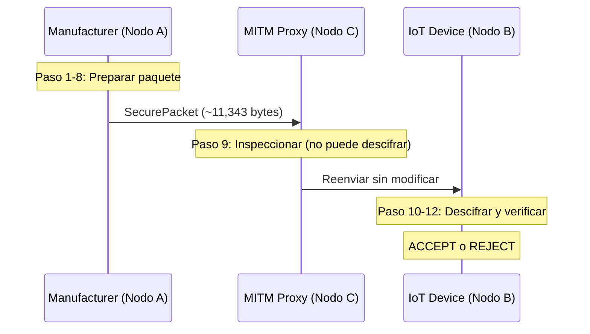

# 05 — Demo Anotada: Qué Sucede Paso a Paso

[← Recorrido del Código](04_recorrido_codigo.md) | [Índice](00_indice.md) | [Siguiente: Modelo de Amenazas →](06_modelo_amenazas.md)

---

Este documento recorre un ciclo completo del protocolo explicando **exactamente qué sucede con los bytes en cada etapa**. Se usa un firmware de 1 KB como ejemplo, con tamaños reales tomados de la implementación.

---

## Demo en 3 laptops (scripts dedicados)

**Guía operativa completa (instalación, red, firewall, fallos):** [09 — Guía demo 3 laptops](09_guia_demo_tres_laptops.md).

Cada rol tiene un script en [`dual_sig_research/demo_nodes/`](../dual_sig_research/demo_nodes/):

| Laptop | Rol | Script | Puerto |
|--------|-----|--------|--------|
| B | IoT (receptor) | `node_receiver.py` | escucha **5001** |
| C | MITM | `node_mitm.py` | escucha **5000**, reenvía a B:5001 |
| A | Manufacturer (emisor) | `node_sender.py` | conecta a C:5000 |

### Requisitos

- Las tres máquinas en la **misma red** (Wi‑Fi/LAN).
- **Mismo archivo de claves** en todas: `dual_sig_research/validation_keys.msgpack`.
- Firewall: permitir TCP **5000** (MITM) y **5001** (receptor).
- `liboqs` con ML-DSA-65 y ML-KEM-768 instalado en cada laptop.

### Preparación (una vez)

Desde `dual_sig_research/` en cualquier PC:

```powershell
cd dual_sig_research
..\venv\Scripts\python.exe demo_nodes\prepare_demo_keys.py
```

Copiar `validation_keys.msgpack` a la misma ruta en los clones del repo de las otras dos laptops.

### Orden de arranque

Sustituir `<IP_B>` y `<IP_C>` por las IPs LAN reales.

```powershell
# Laptop B — receptor (primero)
cd dual_sig_research
..\venv\Scripts\python.exe demo_nodes\node_receiver.py

# Laptop C — MITM (segundo)
..\venv\Scripts\python.exe demo_nodes\node_mitm.py --target <IP_B>

# Laptop A — emisor (tercero; dispara el envío)
..\venv\Scripts\python.exe demo_nodes\node_sender.py --target <IP_C>
```

Firmware por archivo (opcional):

```powershell
..\venv\Scripts\python.exe demo_nodes\node_sender.py --target <IP_C> `
    --firmware firmware_samples\firmware_1kb.bin
```

Si no existe `firmware_samples/`, generar muestras con `benchmark.generate_firmware_samples()` o escribir un mensaje cuando el emisor lo pida.

### Ataque activo (bit-flip)

En la laptop C, usar `--attack` en lugar del proxy pasivo:

```powershell
..\venv\Scripts\python.exe demo_nodes\node_mitm.py --target <IP_B> --attack --flip ciphertext
```

El receptor en B debe terminar con `[ALERT]` y **FIRMWARE REJECTED**.

---

## Cómo Ejecutar la Demo (3 terminales, 1 PC)

Alternativa en un solo equipo con [`network_validation.py`](../dual_sig_research/network_validation.py). Desde el directorio `dual_sig_research/`, abrir tres terminales y ejecutar en este orden:

```bash
# Terminal 1 — IoT Device (Receptor)
..\venv\Scripts\python.exe network_validation.py --scenario local --mode receiver --target-port 5001

# Terminal 2 — Proxy MITM (Observador/Atacante)
..\venv\Scripts\python.exe network_validation.py --scenario local --mode mitm --port 5000 --target-port 5001

# Terminal 3 — Manufacturer (Emisor)
..\venv\Scripts\python.exe network_validation.py --scenario local --mode sender --port 5000
```

El emisor pedirá escribir un mensaje por teclado. Alternativamente, para usar un archivo de firmware directamente:

```bash
# Usar una muestra binaria de 10 KB (sin input por teclado)
..\venv\Scripts\python.exe network_validation.py --scenario local --mode sender --port 5000 \
    --firmware firmware_samples/firmware_10kb.bin
```

Cada terminal muestra paso a paso con colores ANSI: hashes, firmas, KEM, cifrado, intercepción y verificación.

Para la variante de **ataque activo** (bit-flip), reemplazar Terminal 2 por:

```bash
..\venv\Scripts\python.exe network_validation.py --scenario local --mode attack-mitm \
    --port 5000 --target-port 5001 --flip ciphertext
```

El receptor mostrará `[ALERT] Firmware REJECTED`.

---

## Escenario

- **Nodo A (Manufacturer)**: firma y cifra una actualización de firmware.
- **Nodo C (MITM Proxy)**: intercepta el paquete en tránsito.
- **Nodo B (IoT Device)**: recibe, descifra y verifica la actualización.



---

## Paso 1 — Entrada de Firmware

El manufacturer tiene un firmware binario para distribuir. En nuestro ejemplo, son **1,024 bytes** generados con `os.urandom(1024)`:

```
Firmware (primeros 64 bytes en hex):
a7 3b 1f 8c 2d e0 94 ff 12 b8 c4 d1 67 5a 0e 93
f2 1a 7b 4c 88 d3 56 e9 01 cd 3f a2 76 b0 e5 48
...
```

Estos bytes representan el contenido binario completo de la imagen de firmware. En producción sería el binario compilado del firmware del dispositivo.

---

## Paso 2 — Generación de Claves

Se generan dos conjuntos completos de material criptográfico: uno para el manufacturer (firmante) y otro para el device (receptor).

### Claves del Manufacturer

| Algoritmo | Tipo | Tamaño |
|---|---|---|
| Ed25519 | Clave pública (`pk_c`) | 32 bytes |
| Ed25519 | Clave privada (`sk_c`) | 32 bytes |
| ML-DSA-65 | Clave pública (`pk_q`) | 1,952 bytes |
| ML-DSA-65 | Clave privada (`sk_q`) | 4,032 bytes |
| X25519 | Clave pública (`pk_x`) | 32 bytes |
| X25519 | Clave privada (`sk_x`) | 32 bytes |
| ML-KEM-768 | Clave pública (`pk_kem`) | 1,184 bytes |
| ML-KEM-768 | Clave privada (`sk_kem`) | 2,400 bytes |

### Claves del Device

Misma estructura: 8 claves con los mismos tamaños. La clave pública X25519 y la clave pública ML-KEM-768 del device son las que usará el manufacturer para la encapsulación KEM.

**Tiempo total de generación**: ~0.5 ms por participante (media sobre 100 iteraciones en el benchmark).

### ¿Qué sucede internamente?

```
Ed25519.KeyGen():
  sk = 32 bytes aleatorios
  s = SHA-512(sk)[0:32] con clamping de bits
  A = [s]B  (multiplicación escalar sobre Curve25519)
  pk = encode(A)  → 32 bytes

ML-DSA-65.KeyGen():
  ρ = 32 bytes aleatorios
  A = ExpandA(ρ)  → matriz 6×5 en R_q
  s₁ ∈ R_q⁵, s₂ ∈ R_q⁶  con coeficientes en [-4, 4]
  t = A·s₁ + s₂
  pk = (ρ, t₁)  → 1,952 bytes
  sk = (ρ, K, tr, s₁, s₂, t₀)  → 4,032 bytes

X25519.KeyGen():
  sk = 32 bytes aleatorios con clamping
  pk = X25519(sk, 9)  → 32 bytes

ML-KEM-768.KeyGen():
  ρ = 32 bytes aleatorios
  A = ExpandA(ρ)  → matriz 3×3 en R_q (q=3329)
  s, e con coeficientes pequeños
  pk = (ρ, As + e)  → 1,184 bytes
  sk = s  → 2,400 bytes
```

En el protocolo real, las claves del device estarían **pre-provisionadas** en la memoria de solo lectura del dispositivo durante la fabricación. Aquí se generan en runtime para la demostración.

---

## Paso 3 — Hashing del Firmware (SHA3-256)

```
Input:  firmware_bytes  (1,024 bytes)
Output: digest          (32 bytes)
```

La función esponja Keccak procesa los 1,024 bytes en bloques de 136 bytes (rate = 1088 bits), aplica la permutación Keccak-f[1600] en cada bloque, y extrae 256 bits del estado final:

```
digest = SHA3-256(firmware_bytes)
       = e.g. 4a8b...f3c2  (32 bytes = 64 caracteres hex)
```

**Por qué se firma el hash y no el firmware directamente**: Ed25519 acepta mensajes de tamaño arbitrario internamente (usa SHA-512), pero ML-DSA-65 también realiza hashing interno. Al firmar un digest pre-computado de tamaño fijo (32 bytes), nos aseguramos de que:
1. Ambos esquemas firman **exactamente los mismos datos**.
2. El hash se calcula **una sola vez**, independientemente de cuántas firmas se generen.
3. Para firmware de 10 MB, el hash tarda ~17 ms pero solo se hace una vez, no dos.

---

## Paso 4 — Firma Dual (Ed25519 + ML-DSA-65)

### Firma Clásica (Ed25519)

```
Input:  sk_c (clave privada Ed25519), digest (32 bytes)
Output: sig_c (64 bytes)
```

Internamente:
1. $r = \text{SHA-512}(H_{hi}(sk) \| \text{digest}) \pmod{\ell}$ — nonce determinístico.
2. $R = [r]B$ — punto de compromiso.
3. $e = \text{SHA-512}(R \| A \| \text{digest}) \pmod{\ell}$ — desafío.
4. $S = r + e \cdot s \pmod{\ell}$ — respuesta.
5. $\text{sig\_c} = \text{encode}(R) \| \text{encode}(S)$ — 32 + 32 = **64 bytes**.

### Firma Post-Cuántica (ML-DSA-65)

```
Input:  sk_q (4,032 bytes clave privada ML-DSA-65), digest (32 bytes)
Output: sig_q (3,309 bytes)
```

Internamente:
1. Se muestrea un vector de enmascaramiento $\mathbf{y}$ con coeficientes uniformes en $[-\gamma_1+1, \gamma_1]$.
2. Se calcula $\mathbf{w} = \mathbf{A}\mathbf{y}$ y se extrae $\mathbf{w}_1$.
3. Se calcula el desafío $c = H(\text{tr} \| \mathbf{w}_1 \| \text{digest})$.
4. Se calcula $\mathbf{z} = \mathbf{y} + c \cdot \mathbf{s}_1$.
5. **Rejection sampling**: si $\|\mathbf{z}\|_\infty$ es demasiado grande, se aborta y repite desde el paso 1 (en media, ~4.25 intentos para ML-DSA-65).
6. Se construye la firma $\sigma = (\tilde{c}, \mathbf{z}, \mathbf{h})$ — **3,309 bytes**.

### Resultado

```
FirmwareBundle = {
    firmware:  1,024 bytes  (firmware original)
    digest:    32 bytes     (SHA3-256)
    sig_c:     64 bytes     (Ed25519)
    sig_q:     3,309 bytes  (ML-DSA-65)
    pk_c:      32 bytes     (clave pública Ed25519)
    pk_q:      1,952 bytes  (clave pública ML-DSA-65)
    metadata:  ~50 bytes    (algoritmos, etc.)
}
```

**Total del bundle**: ~6,463 bytes para 1 KB de firmware.

**Observación clave**: la firma ML-DSA-65 (3,309 bytes) es ~52x más grande que la firma Ed25519 (64 bytes). Este es el precio de la seguridad post-cuántica en tamaño, pero para firmware, el overhead es aceptable.

---

## Paso 5 — Empaquetado (MessagePack)

El `FirmwareBundle` se serializa con MessagePack:

```
plaintext = msgpack.packb({
    firmware, digest, sig_c, sig_q, pk_c, pk_q, metadata
})
```

MessagePack produce una representación binaria compacta. El overhead sobre los datos crudos es mínimo (~2-5% para headers de tipo y longitud).

```
Tamaño del plaintext serializado: ~6,529 bytes
```

---

## Paso 6 — KEM Híbrido (X25519 + ML-KEM-768)

El emisor necesita establecer una clave simétrica compartida con el receptor **sin intercambio interactivo** (el receptor no está online para un handshake). Se usa un KEM híbrido:

### 6.1 Componente Clásico (X25519)

```
ephemeral_sk = X25519PrivateKey.generate()   → 32 bytes aleatorios
ephemeral_pk = X25519(ephemeral_sk, 9)       → 32 bytes (clave pública efímera)
ss_x25519    = X25519(ephemeral_sk, device.pk_x)  → 32 bytes shared secret
```

El emisor incluye `ephemeral_pk` en el paquete. El receptor calcula:
```
ss_x25519' = X25519(device.sk_x, ephemeral_pk)  → mismo shared secret
```

### 6.2 Componente Post-Cuántico (ML-KEM-768)

```
mlkem_ct, ss_mlkem = ML-KEM-768.Encaps(device.pk_kem)
  mlkem_ct:  1,088 bytes  (ciphertext KEM)
  ss_mlkem:  32 bytes     (shared secret)
```

El receptor decapsula:
```
ss_mlkem' = ML-KEM-768.Decaps(device.sk_kem, mlkem_ct)  → mismo shared secret
```

### 6.3 Derivación de Clave (HKDF)

```
IKM = ss_x25519 || ss_mlkem    → 64 bytes concatenados
K   = HKDF-SHA3-256(IKM, info="hybrid-firmware-kem-v1")  → 32 bytes
```

La clave simétrica $K$ de 256 bits es computacionalmente indistinguible de aleatoria mientras **al menos uno** de los dos shared secrets sea seguro.

**Tamaños de los componentes KEM en el paquete**:
- `x25519_public_key`: 32 bytes
- `mlkem_ciphertext`: 1,088 bytes

---

## Paso 7 — Cifrado AEAD Adaptativo

El plaintext de 6,529 bytes es menor que 100 KB → se selecciona **ChaCha20-Poly1305**.

```
nonce = os.urandom(12)                                → 12 bytes
AAD   = SHA3-256(ephemeral_pk || mlkem_ct || "chacha20-poly1305")  → 32 bytes

(ciphertext, tag) = ChaCha20Poly1305.Encrypt(K, nonce, plaintext, AAD)
  ciphertext: 6,529 bytes  (mismo tamaño que plaintext)
  tag:        16 bytes     (autenticación Poly1305)
```

El **AAD** no se cifra pero se autentica: cualquier modificación del AAD invalidará el tag. Esto vincula los parámetros KEM al cifrado — si un atacante sustituye el `mlkem_ciphertext` o el `ephemeral_pk`, el tag no coincidirá.

---

## Paso 8 — Paquete Final y Transmisión

Se construye el `SecurePacket`:

```
SecurePacket = {
    protocol_version:   1                           (int)
    cipher_identifier:  "chacha20-poly1305"          (str)
    nonce:              12 bytes
    ciphertext:         6,529 bytes
    auth_tag:           16 bytes
    ed25519_signature:  64 bytes
    mldsa_signature:    3,309 bytes
    x25519_public_key:  32 bytes
    mlkem_ciphertext:   1,088 bytes
    metadata:           ~100 bytes
}
```

Se serializa con MessagePack:

```
wire = msgpack.packb(SecurePacket)  → ~11,343 bytes
```

Se transmite por TCP con encabezado de 4 bytes de longitud:

```
TCP → [4 bytes: 11343][11,343 bytes: payload]
```

### Desglose del overhead

```
Firmware original:        1,024 bytes
Paquete en el cable:     11,343 bytes
Overhead:                10,319 bytes (1,008%)
```

El overhead está dominado por:
- Firmas: 64 + 3,309 = 3,373 bytes (33%)
- Clave pública ML-DSA: 1,952 bytes (19%)
- ML-KEM ciphertext: 1,088 bytes (11%)
- Ciphertext del bundle: 6,529 bytes (incluye el firmware + firmas cifradas)

Para firmware de tamaño realista (100 KB - 10 MB), este overhead fijo se **amortiza** y cae por debajo del 1%.

---

## Paso 9 — Intercepción MITM

El Nodo C intercepta los 11,343 bytes. ¿Qué puede ver?

```
VISIBLE (no cifrado):
  - protocol_version: 1
  - cipher_identifier: "chacha20-poly1305"
  - nonce: 12 bytes (público por diseño)
  - auth_tag: 16 bytes
  - ed25519_signature: 64 bytes
  - mldsa_signature: 3,309 bytes
  - x25519_public_key: 32 bytes (clave efímera pública)
  - mlkem_ciphertext: 1,088 bytes

NO VISIBLE (cifrado):
  - Contenido del firmware
  - Digest SHA3-256 del firmware
  - Claves públicas del firmante (dentro del ciphertext)
```

### ¿Qué puede hacer el atacante?

| Acción | ¿Posible? | ¿Por qué? |
|---|---|---|
| Leer el firmware | **No** | Cifrado con ChaCha20-Poly1305, clave derivada de KEM híbrido |
| Derivar la clave simétrica | **No** | Necesitaría la clave privada X25519 o ML-KEM del device |
| Modificar el ciphertext | Sí, pero **detectado** | El tag AEAD cambiará → `InvalidTag` en el receptor |
| Modificar el KEM ciphertext | Sí, pero **detectado** | El AAD incluye el mlkem_ct → tag inválido |
| Forjar una firma válida | **No** | Necesitaría ambas claves privadas del manufacturer |
| Reenviar un paquete antiguo (replay) | Depende | El protocolo no incluye protección anti-replay explícita (fuera de alcance) |

En esta demo, el MITM reenvía el paquete sin modificaciones → el receptor lo acepta.

---

## Paso 10 — Recepción y Decapsulación KEM

El device recibe los 11,343 bytes y deserializa el `SecurePacket`.

### Decapsulación X25519

```
ss_x25519' = X25519(device.sk_x, packet.x25519_public_key)
```

El device usa su clave privada X25519 y la clave efímera pública del emisor. El resultado es el mismo shared secret que calculó el emisor.

### Decapsulación ML-KEM-768

```
ss_mlkem' = ML-KEM-768.Decaps(device.sk_kem, packet.mlkem_ciphertext)
```

La transformación Fujisaki-Okamoto verifica internamente que la decapsulación es consistente (protección IND-CCA2).

### Derivación de Clave

```
K' = HKDF-SHA3-256(ss_x25519' || ss_mlkem', info="hybrid-firmware-kem-v1")
```

$K' = K$ (la misma clave que derivó el emisor) — ambas partes convergen al mismo secreto simétrico.

---

## Paso 11 — Descifrado AEAD

```
AAD' = SHA3-256(packet.x25519_public_key || packet.mlkem_ciphertext || "chacha20-poly1305")

plaintext' = ChaCha20Poly1305.Decrypt(K', packet.nonce, packet.ciphertext || packet.auth_tag, AAD')
```

Si el tag no coincide (ciphertext o AAD modificados), se lanza `InvalidTag` y el firmware se **rechaza inmediatamente** sin intentar verificar firmas.

Si el descifrado es exitoso, se obtiene el plaintext de 6,529 bytes y se deserializa con MessagePack para recuperar el `FirmwareBundle`.

---

## Paso 12 — Verificación Dual (AND)

### 12.1 Integridad del Digest

```
digest' = SHA3-256(bundle.firmware)
assert hmac.compare_digest(digest', bundle.digest)  → ¿coinciden?
```

Si no coinciden, alguien modificó el firmware después de firmarlo → REJECT.

### 12.2 Confianza de Claves Públicas

```
assert hmac.compare_digest(bundle.pk_c, trusted_pk_c)
assert hmac.compare_digest(bundle.pk_q, trusted_pk_q)
```

Las claves públicas del bundle deben coincidir con las claves de confianza que el device tiene pre-provisionadas. Esto previene que un atacante sustituya las claves por las suyas.

### 12.3 Verificación Ed25519

```
pk_c_obj = Ed25519PublicKey.from_public_bytes(trusted_pk_c)
pk_c_obj.verify(bundle.sig_c, bundle.digest)
  → ed_ok = True
```

La librería `cryptography` verifica la ecuación $[8S]B = [8]R + [8 \cdot H(R \| A \| M)]A$ internamente.

### 12.4 Verificación ML-DSA-65

```
ml_ok = oqs.Signature("ML-DSA-65").verify(bundle.digest, bundle.sig_q, trusted_pk_q)
  → ml_ok = True
```

Verifica que $c = H(\text{tr} \| \text{UseHint}(\mathbf{h}, \mathbf{A}\mathbf{z} - c\mathbf{t}) \| M)$ y que $\|\mathbf{z}\|_\infty < \gamma_1 - \beta$.

### 12.5 Decisión AND

```
accepted = ed_ok AND ml_ok  → True
```

**FIRMWARE ACCEPTED — ALL CHECKS PASSED**

El firmware de 1,024 bytes se recupera íntegro e idéntico al original.

---

## Paso 13 — Caso de Fallo: Ataque de Bit-Flip

¿Qué sucede si el MITM modifica 1 bit del ciphertext?

```python
buf = bytearray(packet["ciphertext"])
buf[0] ^= 1  # flippear 1 bit
packet["ciphertext"] = bytes(buf)
```

### Resultado en el Receptor

```
ChaCha20Poly1305.Decrypt(K, nonce, tampered_ciphertext || tag, AAD)
  → InvalidTag exception!
```

El tag Poly1305 es una evaluación polinomial sobre el ciphertext. Cambiar un solo bit del ciphertext produce un tag completamente diferente (avalanche effect). El tag enviado no coincide con el tag recalculado → excepción `InvalidTag`.

El receptor ejecuta:
```python
except InvalidTag as exc:
    logger.critical("[ALERT] Integrity/Decryption Failure: %s", exc)
    return _empty_bundle(), False
```

**FIRMWARE REJECTED — INTEGRITY/DECRYPTION FAILURE**

El firmware ni siquiera se intenta verificar con firmas — la primera barrera (AEAD) ya detectó la manipulación. Esta es una propiedad de seguridad en profundidad: incluso si las firmas tuvieran alguna debilidad, el cifrado autenticado proporciona una capa adicional de protección de integridad.

---

## Resumen de Tiempos (Benchmark Real, 1 KB)

| Fase | Tiempo Medio |
|---|---|
| Hash SHA3-256 | ~0.005 ms |
| Firma dual (Ed25519 + ML-DSA-65) | ~0.486 ms |
| KEM encapsulación | ~0.125 ms |
| Cifrado AEAD | ~0.010 ms |
| **Total emisor** | **~0.626 ms** |
| KEM decapsulación | ~0.099 ms |
| Descifrado AEAD | ~0.009 ms |
| Verificación dual | ~0.146 ms |
| **Total receptor** | **~0.254 ms** |
| **End-to-end** | **~1.18 ms** |

Para una actualización de firmware que ocurre quizá una vez al mes, 1.18 ms de procesamiento criptográfico es completamente imperceptible.

---

[← Recorrido del Código](04_recorrido_codigo.md) | [Índice](00_indice.md) | [Siguiente: Modelo de Amenazas →](06_modelo_amenazas.md)
