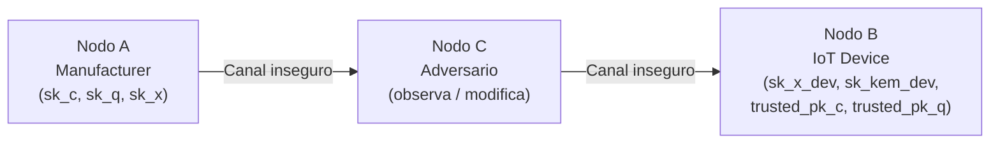

# 06 — Modelo de Amenazas y Garantías de Seguridad

[← Demo Anotada](05_demo_anotada.md) | [Índice](00_indice.md) | [Siguiente: Análisis de Benchmarks →](07_analisis_benchmarks.md)

---

## 1. Modelo de Red

El protocolo asume un **canal inseguro** entre el manufacturer (Nodo A) y el IoT device (Nodo B). Un adversario (Nodo C) tiene capacidades de red según el modelo de Dolev-Yao:

- Puede **observar** todo el tráfico en el canal.
- Puede **interceptar** paquetes y decidir si reenviarlos, descartarlos o modificarlos.
- Puede **inyectar** paquetes arbitrarios en el canal.
- **No** tiene acceso a las claves privadas de A o B (si las tuviera, no habría defensa posible).



---

## 2. Escenarios de Ataque

### Escenario A — Adversario Clásico (Hoy)

**Perfil**: atacante con poder computacional convencional (sin computadora cuántica).

**Análisis por capa**:

| Capa | Primitivo | Problema subyacente | ¿Seguro? |
|---|---|---|---|
| Firma clásica | Ed25519 | ECDLP ($2^{128}$ operaciones) | **Sí** |
| Firma PQ | ML-DSA-65 | Module-SIS/LWE | **Sí** |
| KEM clásico | X25519 | ECDLP | **Sí** |
| KEM PQ | ML-KEM-768 | Module-LWE | **Sí** |
| Cifrado | ChaCha20/AES-256 | — | **Sí** |

**Resultado**: el sistema es **SEGURO** contra adversarios clásicos. El atacante no puede:
- Falsificar firmas (necesitaría resolver ECDLP o Module-SIS).
- Derivar la clave simétrica (necesitaría resolver ECDLP para X25519 o Module-LWE para ML-KEM).
- Descifrar el contenido (necesitaría la clave simétrica de 256 bits).
- Modificar el paquete sin detección (AEAD tag lo detecta).

### Escenario B — Adversario Cuántico (CRQC Futuro)

**Perfil**: atacante con un Cryptanalytically Relevant Quantum Computer capaz de ejecutar el algoritmo de Shor.

**Impacto de Shor**:

| Primitivo | ¿Roto por Shor? | Consecuencia |
|---|---|---|
| Ed25519 | **Sí** ($O(\log^3 n)$) | Puede falsificar firmas Ed25519 |
| X25519 | **Sí** | Puede derivar $ss_{x25519}$ |
| ML-DSA-65 | **No** | Las firmas ML-DSA permanecen válidas |
| ML-KEM-768 | **No** | El $ss_{mlkem}$ permanece secreto |

**Análisis del protocolo**:

- **Autenticación**: Shor rompe Ed25519, pero ML-DSA-65 permanece seguro. Bajo la lógica AND:
  - El atacante podría falsificar $\text{sig\_c}$ (Ed25519).
  - Pero **no puede** falsificar $\text{sig\_q}$ (ML-DSA-65).
  - $\text{ACCEPT} = \text{ed\_ok} \wedge \text{ml\_ok}$: si $\text{ml\_ok}$ falla (firma falsificada) → REJECT.
  - El firmware legítimo firmado con ambas claves sigue verificándose porque ambas firmas originales son válidas.

- **Confidencialidad**: Shor rompe X25519, pero ML-KEM-768 permanece seguro.
  - El atacante puede derivar $ss_{x25519}$ con Shor.
  - Pero **no puede** derivar $ss_{mlkem}$.
  - $K = \text{HKDF}(ss_{x25519} \| ss_{mlkem})$: sin $ss_{mlkem}$, no puede reconstruir $K$.
  - El ciphertext permanece indescifrable.

**Resultado**: el sistema es **SEGURO** contra adversarios cuánticos. La capa post-cuántica (ML-DSA-65 + ML-KEM-768) mantiene tanto la autenticación como la confidencialidad.

### Escenario C — Ambos Primitivos Rotos (Hipotético)

**Perfil**: un adversario que posee simultáneamente:
1. Un CRQC capaz de ejecutar Shor (rompe Ed25519/X25519).
2. Un algoritmo que rompe Module-LWE/SIS (rompe ML-DSA-65/ML-KEM-768).

**Resultado**: el sistema **NO ES SEGURO**. Ambas firmas pueden falsificarse y la clave simétrica puede derivarse.

**Probabilidad**: extremadamente baja. Requiere avances simultáneos en dos frentes de investigación independientes:
- Computación cuántica a escala (para Shor).
- Un breakthrough en criptoanálisis de reticulados (ningún algoritmo eficiente conocido, clásico ni cuántico).

**Mitigación futura**: **cripto-agilidad** — diseñar el sistema para que los algoritmos puedan sustituirse sin cambiar la arquitectura. Si ML-DSA se rompe, reemplazarlo por otro candidato (e.g., SLH-DSA basado en hash) sin modificar el framework.

### Escenario D — Ataques de Implementación

**Perfil**: ataques que explotan la implementación, no la matemática:

| Ataque | Descripción | ¿En alcance? |
|---|---|---|
| Side-channel (timing) | Medir tiempos de operación para extraer claves | **No** |
| Side-channel (power) | Análisis de consumo eléctrico | **No** |
| Fault injection | Inducir errores en el hardware | **No** |
| Buffer overflow | Vulnerabilidades de memoria | **No** |
| RNG defectuoso | Generador de números aleatorios predecible | **Parcial** (se usa `os.urandom()`) |

**Resultado**: estos ataques están **fuera del alcance** de este proyecto. Se reconocen explícitamente como limitaciones. Sin embargo:

- Ed25519 usa nonces determinísticos (no depende del RNG para firmar) — una mitigación natural contra nonces débiles.
- Las comparaciones de claves públicas usan `hmac.compare_digest()` (tiempo constante) — mitigación contra timing attacks en la verificación.
- liboqs implementa internamente las operaciones sensibles con código de tiempo constante (nivel de esfuerzo del proyecto OQS).

---

## 3. Propiedades de Seguridad

### 3.1 Infalsificabilidad Existencial (EUF-CMA)

El esquema de firma dual hereda la propiedad EUF-CMA (Existential Unforgeability under Chosen Message Attack) de ambos componentes. Formalmente, bajo independencia de los primitivos:

$$\Pr[\text{Forge}_{\text{hybrid}}] \leq \Pr[\text{Forge}_{\text{Ed25519}}] \cdot \Pr[\text{Forge}_{\text{ML-DSA}}]$$

Un adversario que pueda falsificar firmas Ed25519 con probabilidad $\epsilon_1$ y firmas ML-DSA con probabilidad $\epsilon_2$ solo puede falsificar el esquema híbrido con probabilidad $\leq \epsilon_1 \cdot \epsilon_2$.

Para Ed25519: $\epsilon_1 \leq 2^{-128}$ (clásico), $\epsilon_1 \approx 1$ (con Shor).
Para ML-DSA-65: $\epsilon_2 \leq 2^{-143}$ (clásico y cuántico estimado).

- **Hoy**: $\Pr[\text{Forge}] \leq 2^{-128} \cdot 2^{-143} = 2^{-271}$ — astronómicamente improbable.
- **Post-cuántico**: $\Pr[\text{Forge}] \leq 1 \cdot 2^{-143} = 2^{-143}$ — aún seguro.

### 3.2 Robustez Transicional

Si **cualquiera** de los dos esquemas de firma se mantiene seguro, el esquema híbrido es seguro:

$$\text{Seguro}_{\text{hybrid}} \Leftrightarrow \text{Seguro}_{\text{Ed25519}} \lor \text{Seguro}_{\text{ML-DSA}}$$

Esta es la propiedad fundamental que motiva el enfoque híbrido.

### 3.3 Confidencialidad Forward Parcial

Cada paquete usa una **clave efímera X25519** generada aleatoriamente. Si la clave estática X25519 del receptor se compromete en el futuro, el atacante aún necesitaría la clave efímera de cada sesión para derivar $ss_{x25519}$ específico. Sin embargo, la clave efímera se destruye después de cada `protect_firmware()`.

Nota: esto no es forward secrecy completa en el sentido de TLS (donde ambas partes contribuyen efímeramente), sino una propiedad de **forward secrecy del emisor**.

ML-KEM también contribuye un shared secret independiente. Comprometer las claves X25519 no compromete $ss_{mlkem}$ y viceversa.

### 3.4 Integridad de Canal (AAD Binding)

El AAD vincula la identidad KEM al cifrado:

$$\text{AAD} = \text{SHA3-256}(\text{eph\_pk} \| \text{mlkem\_ct} \| \text{cipher\_id})$$

Esto previene ataques de sustitución donde el adversario reemplaza los componentes KEM por los suyos. Si el adversario modifica `mlkem_ct`, el AAD recalculado por el receptor no coincidirá con el AAD original, y el tag AEAD fallará.

### 3.5 Indistinguibilidad del Ciphertext (IND-CCA2)

El esquema de cifrado híbrido hereda IND-CCA2 del KEM:
- ML-KEM-768 es IND-CCA2 por la transformación Fujisaki-Okamoto.
- X25519 proporciona IND-CPA (pasivo).
- ChaCha20-Poly1305 y AES-256-GCM son AEAD IND-CCA seguros.

La combinación proporciona IND-CCA2 mientras al menos un KEM sea seguro.

---

## 4. Escenarios de Red Implementados

El proyecto implementa tres escenarios de red para validar estas propiedades:

### 4.1 Escenario A — Local (Observación Pasiva)

```
Sender → MITM Proxy → Receiver  (localhost)
```

El MITM observa el paquete, lo muestra en pantalla, y lo reenvía sin modificar. El receptor acepta el firmware.

**Valida**: confidencialidad (el MITM no puede leer el firmware) y autenticidad (el firmware llega íntegro).

### 4.2 Escenario B — LAN (Wireshark)

Mismo flujo pero con IPs configurables. Permite capturar tráfico con Wireshark para inspeccionar visualmente que los bytes en el cable son opacos.

**Valida**: que la encapsulación del protocolo es correcta sobre TCP real (no solo localhost).

### 4.3 Escenario C — Ataque Activo (Bit-Flip)

```
Sender → Attack Proxy → Receiver
           ↓
    flip 1 bit del ciphertext
```

El proxy modifica un bit del campo `ciphertext` (o del `mlkem_ciphertext`) antes de reenviar. El receptor detecta la modificación y rechaza el paquete.

**Valida**: integridad (AEAD detecta manipulación) y la respuesta del protocolo ante ataques activos.

Variante avanzada: ARP spoofing con scapy para interceptar tráfico real en la LAN sin que el sender/receiver configuren un proxy.

---

## 5. Amenazas No Cubiertas

| Amenaza | Razón de Exclusión |
|---|---|
| Replay attacks | No hay nonce de sesión ni timestamp verificado. Mitigación futura: incluir un contador monotónico o timestamp firmado. |
| Denial of Service | Un atacante puede descartar paquetes. No hay redundancia ni retransmisión en el protocolo. |
| Compromiso de claves privadas | Si el atacante obtiene las claves privadas del manufacturer, puede firmar firmware malicioso. Requiere PKI con revocación (fuera de alcance). |
| Supply chain attacks | Dispositivos fabricados con claves comprometidas. Requiere cadena de confianza de hardware (fuera de alcance). |
| Downgrade attacks | Un atacante podría intentar forzar un protocolo más débil. Mitigación parcial: `protocol_version` está en el paquete. |

---

[← Demo Anotada](05_demo_anotada.md) | [Índice](00_indice.md) | [Siguiente: Análisis de Benchmarks →](07_analisis_benchmarks.md)
