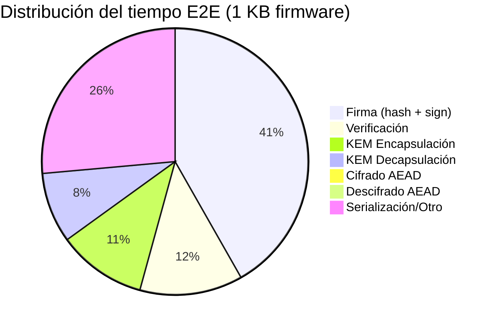
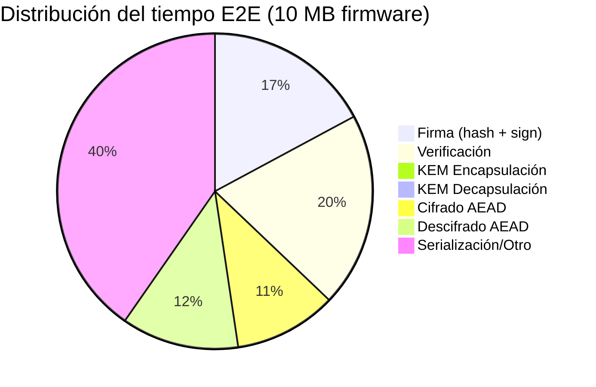

# 07 — Análisis de Benchmarks

[← Modelo de Amenazas](06_modelo_amenazas.md) | [Índice](00_indice.md) | [Siguiente: Limitaciones y Trabajo Futuro →](08_limitaciones_trabajo_futuro.md)

---

Este documento presenta los resultados experimentales reales del benchmarking, obtenidos de los archivos CSV y JSON en `dual_sig_research/results/`. Todos los tiempos son medias sobre 100 iteraciones usando `time.perf_counter_ns()`.

---

## 1. Metodología

### 1.1 Entorno

- **Runtime**: Python 3.11 sobre Windows.
- **Librerías**: liboqs-python (ML-DSA-65, ML-KEM-768), PyCA cryptography (Ed25519, X25519, AEAD).
- **Timing**: `time.perf_counter_ns()` — resolución de nanosegundos, sin overhead de syscalls.
- **Iteraciones**: 100 por cada medición.

### 1.2 Reglas de Benchmarking

- El firmware se genera **una sola vez** antes de los loops de timing (nunca dentro).
- Cada fase se mide **aisladamente**: sign, verify, KEM enc, KEM dec, encrypt, decrypt.
- El benchmark E2E mide el pipeline completo: `protect_firmware()` → `serialize` → `deserialize` → `unprotect_firmware()`.
- Se reportan media, mediana, desviación estándar, mínimo y máximo.

### 1.3 Tamaños de Firmware

| Nombre | Tamaño |
|---|---|
| `firmware_1kb.bin` | 1,024 bytes |
| `firmware_10kb.bin` | 10,240 bytes |
| `firmware_100kb.bin` | 102,400 bytes |
| `firmware_1mb.bin` | 1,048,576 bytes |
| `firmware_10mb.bin` | 10,485,760 bytes |

---

## 2. Generación de Claves Híbridas

Datos de `results/benchmark_keygen.csv` (1000 iteraciones) y `results/benchmark_full_protocol.json` (100 iteraciones):

| Métrica | Valor |
|---|---|
| Media | 0.498 ms |
| Mediana | 0.453 ms |
| Desv. estándar | 0.120 ms |
| Mínimo | 0.365 ms |
| Máximo | 0.893 ms |

La generación incluye los 4 pares de claves: Ed25519 + ML-DSA-65 + X25519 + ML-KEM-768. El componente dominante es ML-DSA-65 (~0.3 ms) seguido de ML-KEM-768 (~0.1 ms). Ed25519 y X25519 son negligibles (~0.01 ms cada uno).

---

## 3. Comparación de Esquemas de Firma (1 KB)

Datos de `results/benchmark_1kb_comparison.csv`:

| Esquema | Firma (media) | Firma (std) | Verificación (media) | Verificación (std) | Bundle (bytes) | Overhead |
|---|---|---|---|---|---|---|
| **Ed25519-only** | 0.019 ms | 0.006 ms | 0.050 ms | 0.013 ms | 1,152 | 12.5% |
| **ML-DSA-65-only** | 0.406 ms | 0.315 ms | 0.095 ms | 0.057 ms | 6,317 | 517% |
| **Hybrid (AND)** | 0.453 ms | 0.347 ms | 0.172 ms | 0.094 ms | 6,413 | 526% |

### Interpretación

- **Ed25519 es ~24x más rápido** en firma que ML-DSA-65. Esto es esperado: la aritmética sobre curvas elípticas de 256 bits es inherentemente más rápida que las operaciones sobre reticulados de dimensión $6 \times 5$ con módulo de 23 bits.

- **El hybrid añade overhead marginal** sobre ML-DSA-65-only:
  - Firma: 0.453 vs 0.406 ms (+12%, el costo de la firma Ed25519 adicional).
  - Verificación: 0.172 vs 0.095 ms (+81%, porque Ed25519 verify es ~0.05 ms y se suma).

- **Bundle size**: el hybrid (6,413 B) es solo 96 bytes más grande que ML-DSA-only (6,317 B) — la firma Ed25519 (64 B) y la clave pública Ed25519 (32 B) son diminutas frente a los componentes ML-DSA.

- **Overhead sobre firmware**: para 1 KB de firmware, el overhead del hybrid es 526%. Esto parece alto, pero es un artefacto del firmware extremadamente pequeño. Para tamaños realistas (100 KB+), el overhead cae a <10%.

### Conclusión de la comparación

El esquema híbrido tiene un costo casi idéntico al de ML-DSA-65-only, pero proporciona robustez transicional (seguridad contra adversarios clásicos Y cuánticos). La firma Ed25519 adicional es "gratis" en la práctica.

---

## 4. Escalamiento por Tamaño de Firmware (Protocolo Completo)

Datos de `results/benchmark_full_protocol.csv` y `benchmark_full_protocol.json`:

### 4.1 Tiempos por Fase

| Firmware | Cifrado | Firma | Verificación | KEM Enc | KEM Dec | Encrypt | Decrypt | E2E |
|---|---|---|---|---|---|---|---|---|
| **1 KB** | ChaCha20 | 0.486 ms | 0.146 ms | 0.125 ms | 0.099 ms | 0.010 ms | 0.009 ms | 1.183 ms |
| **10 KB** | ChaCha20 | 0.682 ms | 0.215 ms | 0.204 ms | 0.117 ms | 0.007 ms | 0.006 ms | 0.970 ms |
| **100 KB** | AES-GCM | 0.602 ms | 0.591 ms | 0.269 ms | 0.079 ms | 0.016 ms | 0.015 ms | 1.346 ms |
| **1 MB** | AES-GCM | 2.103 ms | 2.065 ms | 0.136 ms | 0.069 ms | 0.809 ms | 0.836 ms | 8.578 ms |
| **10 MB** | AES-GCM | 17.402 ms | 20.232 ms | 0.242 ms | 0.112 ms | 10.715 ms | 12.266 ms | 101.932 ms |

### 4.2 Observaciones Clave

**La firma y verificación escalan linealmente con el tamaño del firmware** — esto es porque el hash SHA3-256 domina el tiempo para payloads grandes:

- 1 KB: hash ~0.005 ms (negligible), firma crypto ~0.48 ms.
- 10 MB: hash ~17 ms (dominante), firma crypto ~0.48 ms.

El tiempo de firma criptográfica (Ed25519 + ML-DSA-65) es **constante** (~0.5 ms) independientemente del tamaño del firmware. Lo que escala es el hash previo.

**El KEM es constante** — no depende del tamaño del firmware:

- KEM enc: 0.1-0.3 ms (variabilidad por scheduling del OS).
- KEM dec: 0.06-0.12 ms.

**El cifrado/descifrado escala linealmente** con el tamaño del payload:

- 1 KB: 0.01 ms (ChaCha20).
- 10 MB: 10.7 ms encrypt / 12.3 ms decrypt (AES-256-GCM).
- El switch de ChaCha20 a AES-GCM ocurre en 100 KB (umbral adaptativo).

### 4.3 Overhead Criptográfico

| Firmware | Paquete (bytes) | Overhead |
|---|---|---|
| **1 KB** | 11,343 | 1,008% |
| **10 KB** | 20,559 | 101% |
| **100 KB** | 112,721 | 10.1% |
| **1 MB** | 1,058,897 | 0.98% |
| **10 MB** | 10,496,081 | 0.098% |

El overhead criptográfico fijo es ~10,300 bytes (firmas + claves públicas + KEM ciphertext + metadata). Para firmware grande, este overhead fijo se **amortiza**:

- A 100 KB, el overhead es 10% — aceptable.
- A 1 MB, es <1% — prácticamente invisible.
- A 10 MB, es ~0.1% — negligible.

Los tamaños típicos de firmware IoT oscilan entre 64 KB y 16 MB, lo que sitúa el overhead en el rango de **0.1% a 15%** — completamente aceptable para un canal de actualización que se usa unas pocas veces al año.

### 4.4 Throughput

| Firmware | Throughput |
|---|---|
| **1 KB** | 6.9 Mbps |
| **10 KB** | 84.5 Mbps |
| **100 KB** | 608.7 Mbps |
| **1 MB** | 977.9 Mbps |
| **10 MB** | 823.0 Mbps |

El throughput sube rápidamente con el tamaño del payload porque el costo fijo de firma/KEM se amortiza. La caída a 10 MB (823 vs 978 Mbps) se explica porque el hashing SHA3-256 de 10 MB y el cifrado/descifrado AES-GCM empiezan a dominar el tiempo.

---

## 5. Desglose de Tiempo E2E (1 KB)

Para firmware pequeño:
- La **firma** (hash + Ed25519 + ML-DSA-65) es la fase más costosa (~41% del E2E).
- **KEM** (encapsulación + decapsulación) es el segundo contribuyente (~19%).
- **AEAD** (cifrado + descifrado) es negligible (<2%).
- La **serialización/deserialización** MessagePack y el overhead de Python contribuyen ~26%.

---

## 6. Desglose de Tiempo E2E (10 MB)

Para firmware grande:
- **Hashing SHA3-256** domina dentro de firma y verificación (el hash de 10 MB tarda ~17 ms).
- **AEAD cifrado/descifrado** se vuelve significativo (10.7 + 12.3 ms = ~22.5% del E2E).
- **KEM** es despreciable (<0.5%) — su costo es fijo e independiente del tamaño.
- **Serialización/otro** incluye MessagePack sobre ~10.5 MB de datos + overhead de Python.

---

## 7. Selección Adaptativa de Cifrado

| Firmware | Payload Serializado | Cifrado Seleccionado | Razón |
|---|---|---|---|
| 1 KB | ~6,529 B | **ChaCha20-Poly1305** | < 100 KB |
| 10 KB | ~15,745 B | **ChaCha20-Poly1305** | < 100 KB |
| 100 KB | ~107,907 B | **AES-256-GCM** | ≥ 100 KB |
| 1 MB | ~1,054,083 B | **AES-256-GCM** | ≥ 100 KB |
| 10 MB | ~10,491,267 B | **AES-256-GCM** | ≥ 100 KB |

El umbral funciona como se diseñó:
- Payloads pequeños (1-10 KB) usan ChaCha20, que es eficiente sin AES-NI.
- Payloads grandes (100 KB+) usan AES-256-GCM, aprovechando la aceleración hardware.

Nota: el payload serializado incluye el firmware + firmas + claves públicas + metadata. Por eso el payload de 100 KB de firmware cruza el umbral de 100 KB en el payload serializado (es ~108 KB total).

---

## 8. Resumen Ejecutivo

| Métrica | Valor | Interpretación |
|---|---|---|
| **Keygen híbrido** | 0.498 ms | Generación rápida, ejecutable miles de veces por segundo |
| **Firma híbrida (1 KB)** | 0.486 ms | Sub-milisegundo para firmware típico |
| **Verificación (1 KB)** | 0.146 ms | Verificación más rápida que firma (esperado) |
| **E2E (1 KB)** | 1.18 ms | Pipeline completo en ~1 ms |
| **E2E (1 MB)** | 8.58 ms | Firmware realista en <10 ms |
| **E2E (10 MB)** | 102 ms | Firmware grande en ~100 ms |
| **Overhead (100 KB)** | 10.1% | Aceptable para actualización mensual |
| **Overhead (1 MB)** | 0.98% | Prácticamente invisible |
| **Throughput (1 MB)** | 978 Mbps | Limitado por procesamiento, no por red |

**Conclusión**: el overhead del esquema híbrido dual (firma + cifrado) es completamente aceptable para flujos de actualización de firmware IoT. Los tiempos sub-milisegundo para firma/verificación y el overhead <1% para firmware de 1 MB+ confirman la viabilidad práctica del enfoque.

---

[← Modelo de Amenazas](06_modelo_amenazas.md) | [Índice](00_indice.md) | [Siguiente: Limitaciones y Trabajo Futuro →](08_limitaciones_trabajo_futuro.md)
