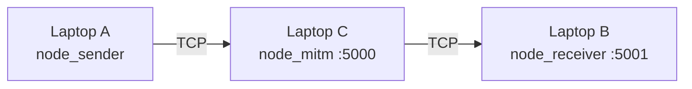

# 09 — Guía práctica: demo en 3 laptops

[← Demo Anotada (bytes paso a paso)](05_demo_anotada.md) | [Índice](00_indice.md) | [Arquitectura de red](03_arquitectura_protocolo.md#81-formato-de-trama-tcp)

---

Esta guía explica **cómo poner en marcha** la demo de aula con tres equipos. Para el detalle criptográfico de cada paso (qué bytes circulan), ver [05 — Demo Anotada](05_demo_anotada.md).

---

## 1. Qué vas a demostrar

Tres roles en red:

| Laptop | Rol | Script | Qué hace |
|--------|-----|--------|----------|
| **A** | Manufacturer (emisor) | `demo_nodes/node_sender.py` | Firma (Ed25519 + ML-DSA-65), cifra y envía el firmware |
| **C** | MITM (observador/atacante) | `demo_nodes/node_mitm.py` | Intercepta el paquete TCP; puede reenviarlo o corromper 1 bit |
| **B** | IoT (receptor) | `demo_nodes/node_receiver.py` | Descifra y verifica; acepta solo si **ambas** firmas son válidas |



Puertos fijos:

- **5000** — escucha el MITM (A se conecta aquí).
- **5001** — escucha el receptor (C reenvía aquí).

---

## 2. Requisitos previos

### En las tres laptops

- Python **3.10+**
- Clon del repositorio (misma estructura de carpetas en todas)
- Misma red local (Wi‑Fi o cable; sin aislamiento “cliente aislado” del AP)
- `liboqs-python` con soporte **ML-DSA-65** y **ML-KEM-768** (no sustituir por otros algoritmos)

### Comprobar liboqs (en cada máquina)

Desde la raíz del repo (`implementation/`):

```powershell
python -m venv venv
.\venv\Scripts\Activate.ps1
pip install -r requirements.txt
cd dual_sig_research
python -c "import oqs; s=oqs.Signature('ML-DSA-65'); k=oqs.KeyEncapsulation('ML-KEM-768'); print('OK', s.details, k.details)"
```

Si falla la importación o el nombre del algoritmo, actualiza `liboqs` / `liboqs-python` antes de la clase.

---

## 3. Instalación del entorno (una vez por laptop)

En **cada** equipo, desde `implementation/`:

```powershell
cd C:\ruta\al\repo\implementation
python -m venv venv
.\venv\Scripts\Activate.ps1
pip install -r requirements.txt
```

Todos los comandos de demo se ejecutan con el venv activado y el directorio de trabajo en `dual_sig_research/`:

```powershell
cd dual_sig_research
```

---

## 4. Claves compartidas (crítico)

Manufacturer y receptor deben usar **el mismo** par de claves pregenerado. Si cada laptop genera el suyo, la verificación fallará aunque la red funcione.

### Generar (una sola vez, en cualquier laptop)

```powershell
cd dual_sig_research
..\venv\Scripts\python.exe demo_nodes\prepare_demo_keys.py
```

Se crea:

`dual_sig_research/validation_keys.msgpack`

### Distribuir

Copia ese archivo a la **misma ruta** en las otras dos laptops (USB, Teams, carpeta compartida, etc.):

```
implementation/dual_sig_research/validation_keys.msgpack
```

**No** subas este archivo a Git (contiene claves privadas; ya está en `.gitignore`).

**No** ejecutes `prepare_demo_keys.py` por separado en cada PC si ya tienes un archivo copiado (sobrescribiría las claves).

El script `node_mitm.py` **no** usa ni crea claves; puedes arrancar el MITM sin `validation_keys.msgpack` en la laptop C.

---

## 5. Obtener las IPs

En cada laptop (PowerShell):

```powershell
ipconfig
```

Anota la **IPv4** de la interfaz conectada a la red del aula, por ejemplo:

| Máquina | IP de ejemplo |
|---------|----------------|
| B (receptor) | `192.168.1.20` |
| C (MITM) | `192.168.1.30` |
| A (emisor) | `192.168.1.10` |

Comprueba conectividad desde A hacia C y desde C hacia B:

```powershell
ping 192.168.1.30
ping 192.168.1.20
```

---

## 6. Firewall de Windows

Permite Python entrante en los puertos de la demo (en B y C):

1. **Firewall de Windows** → **Configuración avanzada** → **Reglas de entrada**
2. Nueva regla → Puerto → TCP → **5001** (receptor) o **5000** (MITM)
3. Permitir conexión → perfil Privado (o el que use tu red del aula)

O, solo para prueba en laboratorio: desactivar temporalmente el firewall en B y C (menos recomendable).

---

## 7. Ejecución en clase (orden obligatorio)

Sustituye `<IP_B>` y `<IP_C>` por las IPs reales.

### Paso 1 — Laptop B (receptor), primero

```powershell
cd dual_sig_research
..\venv\Scripts\python.exe demo_nodes\node_receiver.py
```

Debe mostrar: `Waiting for firmware update...` (escucha en `0.0.0.0:5001`).

### Paso 2 — Laptop C (MITM), segundo

**Proxy pasivo** (reenvía sin tocar):

```powershell
cd dual_sig_research
..\venv\Scripts\python.exe demo_nodes\node_mitm.py --target <IP_B>
```

Debe mostrar: `Waiting for incoming packet...` (escucha en `:5000`).

### Paso 3 — Laptop A (emisor), tercero

```powershell
cd dual_sig_research
..\venv\Scripts\python.exe demo_nodes\node_sender.py --target <IP_C>
```

Escribe un mensaje cuando lo pida (simula el firmware) o usa un archivo:

```powershell
..\venv\Scripts\python.exe demo_nodes\node_sender.py --target <IP_C> `
    --firmware firmware_samples\firmware_1kb.bin
```

Si no existe `firmware_samples/`, genera muestras una vez:

```powershell
..\venv\Scripts\python.exe -c "from benchmark import generate_firmware_samples; generate_firmware_samples()"
```

### Resultado esperado

| Terminal | Mensaje clave |
|----------|----------------|
| A (sender) | `[OK] Transmitted ... bytes` → `SENDER COMPLETE` |
| C (mitm) | Vista del atacante (ciphertext opaco) → `Forwarded ... bytes` |
| B (receiver) | `FIRMWARE ACCEPTED -- ALL CHECKS PASSED` |

---

## 8. Variante: ataque activo (bit-flip)

En la laptop **C**, en lugar del MITM pasivo:

```powershell
..\venv\Scripts\python.exe demo_nodes\node_mitm.py --target <IP_B> --attack --flip ciphertext
```

Opcional: `--flip kem` para corromper el ciphertext ML-KEM en lugar del payload cifrado.

En **B** debe aparecer error de descifrado o verificación y **FIRMWARE REJECTED** / `[ALERT]`.

---

## 9. Prueba en un solo PC (antes de la clase)

Valida el entorno sin red LAN usando `127.0.0.1` y **tres terminales**:

```powershell
# Terminal 1
cd dual_sig_research
..\venv\Scripts\python.exe demo_nodes\node_receiver.py

# Terminal 2
..\venv\Scripts\python.exe demo_nodes\node_mitm.py --target 127.0.0.1

# Terminal 3
..\venv\Scripts\python.exe demo_nodes\node_sender.py --target 127.0.0.1
```

Alternativa equivalente (un solo módulo, sin carpeta `demo_nodes/`):

```powershell
..\venv\Scripts\python.exe network_validation.py --scenario local --mode receiver --target-port 5001
..\venv\Scripts\python.exe network_validation.py --scenario local --mode mitm --port 5000 --target-port 5001
..\venv\Scripts\python.exe network_validation.py --scenario local --mode sender --port 5000
```

---

## 10. Solución de problemas

| Síntoma | Causa probable | Qué hacer |
|---------|----------------|-----------|
| `Connection refused` en A | MITM no arrancado o IP/puerto incorrectos | Arranca C antes que A; verifica `--target <IP_C>` y puerto 5000 |
| `Connection refused` en C al reenviar | Receptor no arrancado o firewall en B | Arranca B primero; abre puerto 5001 en B |
| Verificación de firma falla | Claves distintas entre laptops | Copia el **mismo** `validation_keys.msgpack` a las tres |
| `ML-DSA-65` / `ML-KEM-768` no disponible | liboqs antiguo o mal instalado | Reinstala `liboqs-python>=0.10.0`; verifica con el comando de la sección 2 |
| MITM conecta pero B no recibe | IP_B incorrecta en `--target` | Usa la IP de B, no la de C |
| Timeout / sin salida en B | Orden invertido (sender antes que receiver) | Siempre B → C → A |
| `file not found` en `--firmware` | Falta `firmware_samples/` | Genera muestras con `benchmark` o envía texto por teclado |

### Comandos útiles de diagnóstico

```powershell
# ¿Escucha alguien en 5000/5001? (en B o C)
netstat -an | findstr "5000 5001"

# ¿Llega tráfico? (requiere permisos; opcional)
# Captura con Wireshark: filtro tcp.port == 5000 || tcp.port == 5001
```

---

## 11. Referencia rápida de scripts

| Archivo | Argumentos principales |
|---------|------------------------|
| `demo_nodes/prepare_demo_keys.py` | `--keys-file` (opcional) |
| `demo_nodes/node_receiver.py` | `--host`, `--port` (default 5001), `--keys-file`, `-v` |
| `demo_nodes/node_mitm.py` | `--target` (obligatorio), `--target-port`, `--attack`, `--flip` |
| `demo_nodes/node_sender.py` | `--target` (obligatorio), `--port`, `--firmware`, `--keys-file`, `-v` |

Código compartido: [`dual_sig_research/network_validation.py`](../dual_sig_research/network_validation.py).

---

## 12. Checklist el día de la demo

- [ ] Repo clonado y `pip install -r requirements.txt` en A, B y C
- [ ] `prepare_demo_keys.py` ejecutado **una vez**; `validation_keys.msgpack` copiado a B y C (y A)
- [ ] IPs anotadas; `ping` entre máquinas OK
- [ ] Puertos 5000 y 5001 permitidos en firewall (B y C)
- [ ] Prueba local en 1 PC con `127.0.0.1` OK
- [ ] Orden en vivo: **receptor → MITM → sender**
- [ ] (Opcional) Segunda pasada con `--attack` para mostrar rechazo

---

[← Demo Anotada](05_demo_anotada.md) | [Índice](00_indice.md)
