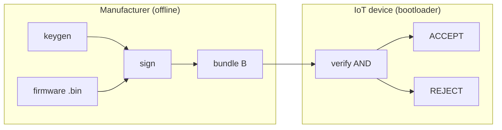

# Dual-Signature Research — Project Workflow

This document describes how the hybrid firmware authentication pipeline works end-to-end, how the benchmark suite is organized, and where results and figures live.

---

## End-to-end flow

The project implements a **dual-signature firmware authentication pipeline**: the manufacturer signs once with **Ed25519** and **ML-DSA-65** over the same digest; the device accepts an update only if **both** signatures verify (AND logic).



### 1. Key generation (once) — `protocol.keygen()`

- Ed25519 keypair via PyCA `cryptography`
- ML-DSA-65 keypair via liboqs (`oqs.Signature("ML-DSA-65")`)
- Returns `(pk_c, sk_c, pk_q, sk_q)` — the two schemes are independent

### 2. Firmware preparation (once per size) — `benchmark.generate_firmware_samples()`

- Writes fixed binaries under `dual_sig_research/firmware_samples/`:
  - `firmware_1kb.bin`, `firmware_10kb.bin`, `firmware_100kb.bin`, `firmware_1mb.bin`
- Generated with `os.urandom()` and **reused** across all benchmark iterations (never regenerated inside timing loops)

### 3. Signing (per release) — `protocol.sign(firmware, sk_c, sk_q, pk_q)`

1. `digest ← SHA3-256(firmware)`
2. `sig_c ← Ed25519.Sign(sk_c, digest)`
3. `sig_q ← ML-DSA-65.Sign(sk_q, digest)` (oqs: `secret_key=sk_q`)
4. Bundle **B** contains: `firmware`, `digest`, `sig_c`, `sig_q`, `pk_c`, `pk_q`

`pk_q` must be supplied from the same `keygen()` call (liboqs does not expose public key export from secret key alone).

### 4. Verification (per update) — `protocol.verify(bundle, trusted_pk_c, trusted_pk_q)`

All checks must pass (**AND**):

1. Re-hash firmware → digest must match bundle digest
2. Ed25519 verify on digest
3. ML-DSA-65 verify on digest
4. Bundle `pk_c` / `pk_q` must match trusted public keys

Any failure → `False` (reject).

---

## Code layout

| File | Role |
|------|------|
| `dual_sig_research/protocol.py` | Crypto only: `keygen()`, `sign()`, `verify()` |
| `dual_sig_research/benchmark.py` | Measurement, CSV export, figure generation; uses `protocol` for sanity tests |

`benchmark.py` does **not** re-implement the protocol for timing. It isolates **hash**, **sign**, and **verify** with `time.perf_counter()` according to the kickoff specification.

---

## Benchmark workflow

Run from `dual_sig_research/`:

```bash
..\venv\Scripts\python.exe benchmark.py
```

Execution order:

1. **Environment check** — ML-DSA-65 must be enabled in oqs; stop otherwise
2. **Sanity tests** — valid bundle verifies; tampered firmware rejected
3. **Single hybrid keygen** — keys reused for phases 2–3
4. **Phase 1 — Keygen** — 1000× full `keygen()` → `results/benchmark_keygen.csv`
5. **Phase 2 — Scheme comparison (1KB)** — 1000× each: Ed25519-only, ML-DSA-65-only, Hybrid
   - Hash timed separately (not included in sign/verify aggregates)
   - Hybrid sign time = Ed25519 sign + ML-DSA sign per iteration (summed, not re-run)
   - Bundle sizes computed once per scheme → `results/benchmark_1kb_comparison.csv`
6. **Phase 3 — Hybrid scaling** — 1000× per payload size (1KB → 1MB) → `results/benchmark_hybrid_scaling.csv`
7. **Figures** — `results/figures/fig1–fig3.png`
8. **Summary table** — printed to console

---

## Output artifacts

```
dual_sig_research/
├── protocol.py
├── benchmark.py
├── firmware_samples/          # fixed test payloads
└── results/
    ├── benchmark_keygen.csv
    ├── benchmark_1kb_comparison.csv
    ├── benchmark_hybrid_scaling.csv
    └── figures/
        ├── fig1_scheme_comparison.png
        ├── fig2_payload_scaling.png
        └── fig3_bundle_overhead.png
```

### CSV schemas

**`benchmark_keygen.csv`**

| Column | Description |
|--------|-------------|
| `iteration` | 1…1000 |
| `keygen_time_ms` | Full hybrid keygen time (ms) |

**`benchmark_1kb_comparison.csv`**

| Column | Description |
|--------|-------------|
| `scheme` | Ed25519-only / ML-DSA-65-only / Hybrid |
| `mean_sign_ms`, `std_sign_ms` | Crypto sign only (hash excluded) |
| `mean_verify_ms`, `std_verify_ms` | Crypto verify only |
| `bundle_bytes`, `overhead_pct` | Transmission size vs firmware |

**`benchmark_hybrid_scaling.csv`**

| Column | Description |
|--------|-------------|
| `fw_size_bytes` | 1024, 10240, 102400, 1048576 |
| `mean_hash_ms` | SHA3-256 over firmware |
| `mean_sign_ms`, `std_sign_ms` | Ed25519 + ML-DSA sign |
| `mean_verify_ms`, `std_verify_ms` | AND verify |
| `bundle_bytes`, `overhead_pct` | Per payload size |

---

## Benchmark figures

### Figure 1 — Scheme comparison (1KB firmware)

Sign and verify mean times (ms) for Ed25519-only, ML-DSA-65-only, and Hybrid.


### Figure 2 — Hybrid payload scaling

Sign and verify time vs firmware size (log₂ x-axis).


### Figure 3 — Bundle size breakdown (hybrid)

Stacked firmware vs authentication metadata (digest, signatures, public keys).


---

## Design notes

- **Same digest for both signatures** — schemes remain independent; no sign-over-sign nesting.
- **`pk_q` in `sign()`** — required because liboqs provides `export_secret_key()` but not public key recovery from SK alone.
- **Hybrid security** — forging one algorithm is insufficient; the verifier requires both valid signatures and trusted public keys.
- **Benchmark honesty** — firmware bytes and keys are fixed outside inner loops; ML-DSA signers use `secret_key=` at construction; oqs objects are freed after benchmark functions that hold long-lived instances.

---

## Reference

- Implementation spec: [`kickoff_prompt.md`](kickoff_prompt.md)
- Agent constraints: [`../AGENTS.md`](../AGENTS.md)
- Protocol pseudocode and paper context: [`Project_briefing_team.md`](Project_briefing_team.md)
